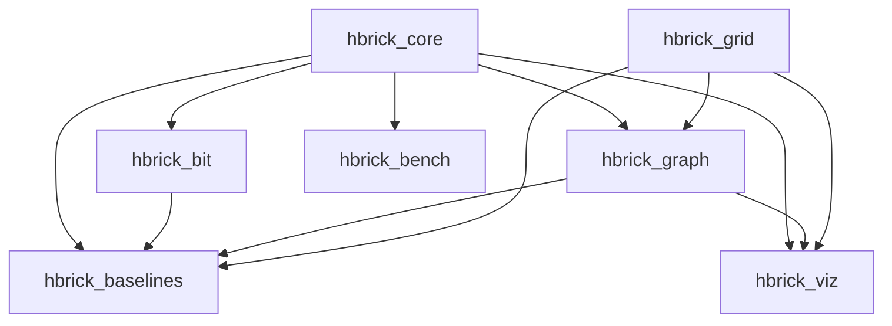
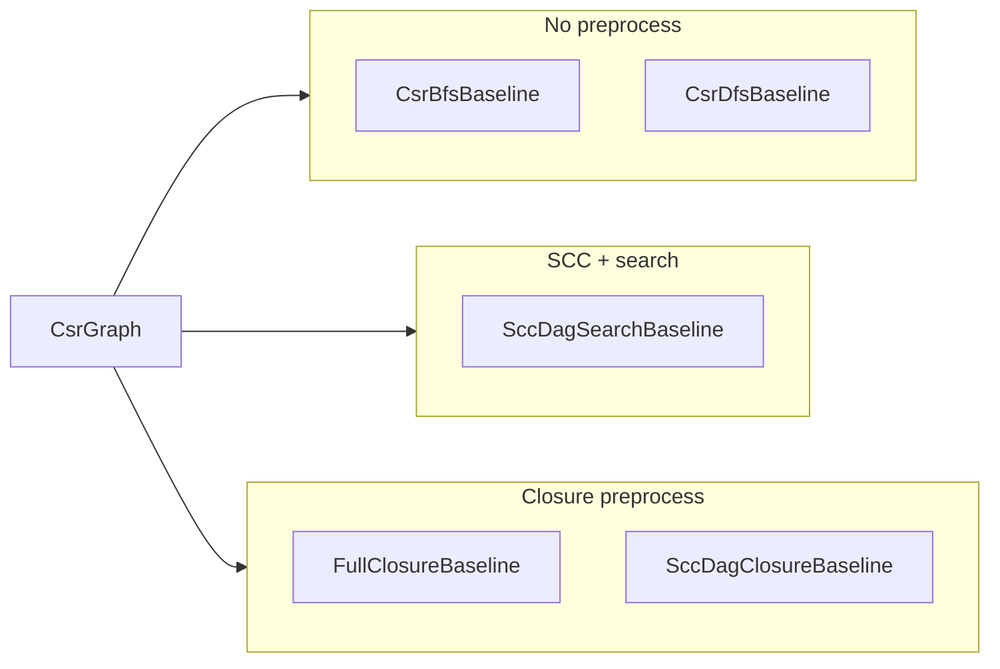

# hbrick Atlas

A quick reference for every major type, data structure, and algorithm in the library.

**See also:** [Representations guide](representations.md) — how mazes, grids, and graphs relate and why conversion happens.

---

## Module dependencies

---

## hbrick_core

Shared identifiers, query descriptors, and status types.

| Name | Header | Represents | Purpose | When to use |
|------|--------|------------|---------|-------------|
| [`VertexId`](../include/hbrick/core/vertex_id.hpp) | `core/vertex_id.hpp` | Typed graph vertex index | Wraps a `uint32_t` index with an invalid sentinel | Any API that takes or returns a vertex identifier |
| [`GridCoord`](../include/hbrick/core/grid_coord.hpp) | `core/grid_coord.hpp` | 2D grid cell `(x, y)` | Row-major `linearIndex()` for coord ↔ index mapping | Grid navigation, rendering, grid-to-vertex conversion |
| [`ReachabilityQuery`](../include/hbrick/core/reachability_query.hpp) | `core/reachability_query.hpp` | Source/target vertex pair | Describes a single reachability question with validity check | Baseline and test harness query descriptors |
| [`ReachabilityAnswer`](../include/hbrick/core/types.hpp) | `core/types.hpp` | Query result enum | `Reachable` or `Unreachable` | Return type for all reachability algorithms |
| [`BaselineStatus`](../include/hbrick/core/types.hpp) | `core/types.hpp` | Preprocess lifecycle enum | `NotRun`, `Completed`, `SkippedByPolicy`, `OutOfMemory`, `Failed` | Report outcome of baseline preprocessing |
| [`kInvalidVertexId`](../include/hbrick/core/vertex_id.hpp) | `core/vertex_id.hpp` | Sentinel constant | `uint32_t` max value marking an invalid vertex | Default/uninitialized vertex state |
| [`toString(ReachabilityAnswer)`](../include/hbrick/core/status_reporting.hpp) | `core/status_reporting.hpp` | Diagnostic string | Human-readable reachability label | Logging and test output (not hot paths) |
| [`toString(BaselineStatus)`](../include/hbrick/core/status_reporting.hpp) | `core/status_reporting.hpp` | Diagnostic string | Human-readable baseline status label | Logging and test output (not hot paths) |
| [`libraryVersion()`](../include/hbrick/core/version.hpp) | `core/version.hpp` | Version metadata | Returns compile-time library version string | Version checks in tools and tests |

---

## hbrick_grid

Rectangular maze layouts — the primary **input** format for maze-embedded graphs.

| Name | Header | Represents | Purpose | When to use |
|------|--------|------------|---------|-------------|
| [`MazeLayout`](../include/hbrick/grid/maze_layout.hpp) | `grid/maze_layout.hpp` | Dense bitmap of passable/blocked cells | Mutable grid with coord ↔ vertex mapping and east/south adjacency enumeration | Building or loading maze layouts before graph conversion |
| [`GridDimensions`](../include/hbrick/grid/grid_dimensions.hpp) | `grid/grid_dimensions.hpp` | Width/height metadata | Bounds checking and cell count (`width × height`) | Grid sizing without storing cell data |
| [`Direction`](../include/hbrick/grid/direction.hpp) | `grid/direction.hpp` | Cardinal step (E/S/W/N) | Delta offsets for 4-connected neighbor queries | Walking the grid from a cell |

---

## hbrick_bit

Bit-parallel boolean vectors and transitive closure.

| Name | Header | Represents | Purpose | When to use |
|------|--------|------------|---------|-------------|
| [`BitVector`](../include/hbrick/bit/bit_vector.hpp) | `bit/bit_vector.hpp` | Fixed-width bitset (`uint64_t` words) | `test` / `set` / `reset` / `rowOr` without hot-path allocation | Single reachability row or boolean flag set |
| [`BitMatrix`](../include/hbrick/bit/bit_matrix.hpp) | `bit/bit_matrix.hpp` | Dense V×V boolean matrix | One `BitVector` per row; row-wise bit-parallel access | Adjacency or reachability matrix storage |
| [`BooleanClosure`](../include/hbrick/bit/boolean_closure.hpp) | `bit/boolean_closure.hpp` | Transitive-closure algorithm | Warshall's algorithm on `BitMatrix` (`transitiveClosureWarshall`) | Precomputing all-pairs reachability into a bit matrix |

---

## hbrick_graph — storage and builders

Graph topology representations and construction utilities.

| Name | Header | Represents | Purpose | When to use |
|------|--------|------------|---------|-------------|
| [`Edge32`](../include/hbrick/graph/edge32.hpp) | `graph/edge32.hpp` | Directed edge `(from, to)` | Lightweight pair of `uint32_t` indices | Ephemeral edge during graph construction |
| [`CsrGraphBuilder`](../include/hbrick/graph/csr_graph_builder.hpp) | `graph/csr_graph_builder.hpp` | Mutable edge collector | Accumulates `Edge32`, sorts, compacts into CSR | Building any directed graph (grid-derived or hand-crafted) |
| [`CsrGraph`](../include/hbrick/graph/csr_graph.hpp) | `graph/csr_graph.hpp` | Immutable directed graph (CSR) | `row_ptrs` + `col_indices`; allocation-free `outNeighbors()` spans | **Canonical** algorithmic graph representation |
| [`DirectedGridGraph`](../include/hbrick/graph/directed_grid_graph.hpp) | `graph/directed_grid_graph.hpp` | CSR graph + grid metadata | Wraps `CsrGraph` with `width`/`height` and coord helpers | When you need both adjacency lists and grid coordinates |
| [`DirectedGridGraphBuilder`](../include/hbrick/graph/directed_grid_graph_builder.hpp) | `graph/directed_grid_graph_builder.hpp` | Grid-to-graph factory | Converts `MazeLayout` adjacencies into directed edges | Primary entry point for maze/grid → graph conversion |
| [`GridEdgeConversionMode`](../include/hbrick/graph/random_asymmetric_params.hpp) | `graph/random_asymmetric_params.hpp` | Edge-orientation policy enum | `RandomAsymmetric`, `BidirectionalAll`, `AcyclicEastSouth` | Choose how undirected corridors become directed arcs |
| [`RandomAsymmetricParams`](../include/hbrick/graph/random_asymmetric_params.hpp) | `graph/random_asymmetric_params.hpp` | RNG seed and probabilities | Controls seeded random edge orientation | Parameterize `RandomAsymmetric` conversion mode |

---

## hbrick_graph — algorithms and scratch

Search, decomposition, and reusable traversal workspace.

| Name | Header | Represents | Purpose | When to use |
|------|--------|------------|---------|-------------|
| [`Bfs`](../include/hbrick/graph/bfs.hpp) | `graph/bfs.hpp` | BFS reachability algorithm | Single-pair reachability via breadth-first search on `CsrGraph` | General directed-graph reachability; correctness oracle |
| [`Dfs`](../include/hbrick/graph/dfs.hpp) | `graph/dfs.hpp` | DFS reachability algorithm | Single-pair reachability via depth-first search on `CsrGraph` | Alternative search baseline; SCC building block |
| [`SccDecomposition`](../include/hbrick/graph/scc_decomposition.hpp) | `graph/scc_decomposition.hpp` | SCC labeling | Kosaraju two-pass DFS; maps each vertex → component id | Detect strongly connected components in cyclic graphs |
| [`CondensationGraph`](../include/hbrick/graph/condensation_graph.hpp) | `graph/condensation_graph.hpp` | SCC condensation DAG | Bundles `SccDecomposition` with induced component-level `CsrGraph` | Reduce cyclic graphs to a DAG of super-nodes |
| [`DagReachability`](../include/hbrick/graph/dag_reachability.hpp) | `graph/dag_reachability.hpp` | DAG reachability algorithm | Reachability on acyclic graphs (delegates to BFS) | Query condensation DAGs or acyclic grid conversions |
| [`GraphSearchScratch`](../include/hbrick/graph/graph_search_scratch.hpp) | `graph/graph_search_scratch.hpp` | Traversal workspace | Reusable BFS queue, DFS stack, generation-stamp visited array | Pass to every search/SCC call to avoid hot-path allocation |

**Deep dive:** [`graph_search_scratch.md`](graph_search_scratch.md)

---

## hbrick_baselines

Reference preprocess/query pipelines for correctness validation and benchmarking.

| Name | Header | Represents | Purpose | When to use |
|------|--------|------------|---------|-------------|
| [`CsrBfsBaseline`](../include/hbrick/baselines/csr_bfs_baseline.hpp) | `baselines/csr_bfs_baseline.hpp` | Search baseline (BFS) | Stores CSR copy; runs BFS per query | Minimal-preprocess correctness oracle |
| [`CsrDfsBaseline`](../include/hbrick/baselines/csr_dfs_baseline.hpp) | `baselines/csr_dfs_baseline.hpp` | Search baseline (DFS) | Stores CSR copy; runs DFS per query | Compare search strategies; correctness oracle |
| [`SccDagSearchBaseline`](../include/hbrick/baselines/scc_dag_search_baseline.hpp) | `baselines/scc_dag_search_baseline.hpp` | SCC + DAG search baseline | Preprocess: SCC + condensation; query: map to components + DAG BFS | Validate SCC condensation pipeline on cyclic graphs |
| [`FullClosureBaseline`](../include/hbrick/baselines/full_closure_baseline.hpp) | `baselines/full_closure_baseline.hpp` | Full closure baseline | Preprocess: V×V transitive closure; query: O(1) bit lookup | All-pairs oracle when memory budget allows |
| [`SccDagClosureBaseline`](../include/hbrick/baselines/scc_dag_closure_baseline.hpp) | `baselines/scc_dag_closure_baseline.hpp` | SCC + component closure baseline | Preprocess: SCC + C² component closure; query: O(1) lookup | Closure oracle with lower memory on sparse SCC structure |
| [`ClosureMatrixBuilder`](../include/hbrick/baselines/closure_matrix_builder.hpp) | `baselines/closure_matrix_builder.hpp` | Closure preprocessing utility | Estimates memory, checks budget, builds reflexive adjacency `BitMatrix` from `CsrGraph` | Shared helper for closure-based baselines |

| Baseline | Preprocess cost | Query cost | Memory |
|----------|----------------|------------|--------|
| `CsrBfsBaseline` / `CsrDfsBaseline` | Copy graph | O(V + E) search | O(V + E) |
| `SccDagSearchBaseline` | SCC + condensation | O(C + E_c) DAG search | O(V + E) |
| `FullClosureBaseline` | O(V³) Warshall | O(1) bit test | O(V²) bits |
| `SccDagClosureBaseline` | SCC + component Warshall | O(1) bit test | O(C²) bits |

---

## hbrick_bench

Lightweight timing helpers for micro-benchmarks.

| Name | Header | Represents | Purpose | When to use |
|------|--------|------------|---------|-------------|
| [`BenchTimer`](../include/hbrick/bench/bench_timer.hpp) | `bench/bench_timer.hpp` | Stopwatch | Monotonic start/stop with nanosecond elapsed total | Manual timing of hot-path routines |
| [`BenchSample`](../include/hbrick/bench/bench_sample.hpp) | `bench/bench_sample.hpp` | Timing result record | Name, iteration count, total elapsed nanoseconds | Store and report benchmark results |
| [`measureRepeated`](../include/hbrick/bench/bench_measure.hpp) | `bench/bench_measure.hpp` | Benchmark helper template | Runs a callable N times and returns a `BenchSample` | Repeated micro-benchmark measurement |

---

## hbrick_viz

SVG rendering for debugging and test artifacts.

| Name | Header | Represents | Purpose | When to use |
|------|--------|------------|---------|-------------|
| [`SvgCanvas`](../include/hbrick/viz/svg_canvas.hpp) | `viz/svg_canvas.hpp` | In-memory SVG document | Lines, rectangles, text with XML escaping | Low-level drawing primitive for tests and viz |
| [`GridGraphRenderer`](../include/hbrick/viz/grid_graph_renderer.hpp) | `viz/grid_graph_renderer.hpp` | Grid + graph renderer | Draws passable cells and directed edge arrows to SVG | Visualize a maze and its directed graph |

---

## hbrick_test_support

**Not part of the shipped library API.** Helpers in `tests/support/` used by integration and regression tests.

| Name | Header | Represents | Purpose | When to use |
|------|--------|------------|---------|-------------|
| [`MazeParams`](../tests/support/maze_generator.hpp) | `tests/support/maze_generator.hpp` | Maze generation config | Logical room count and carving seed | Parameterize deterministic maze fixtures |
| [`generatePerfectMaze`](../tests/support/maze_generator.hpp) | `tests/support/maze_generator.hpp` | Maze generator | Recursive backtracking → tree maze as `MazeLayout` | Integration tests needing acyclic undirected topology |
| [`generateMazeWithExtraPassages`](../tests/support/maze_generator.hpp) | `tests/support/maze_generator.hpp` | Cyclic maze generator | Adds extra wall removals to introduce cycles | Tests requiring cyclic undirected topology |
| [`buildGridGraph`](../tests/support/reachability_oracle.hpp) | `tests/support/reachability_oracle.hpp` | Grid-to-CSR wrapper | `DirectedGridGraphBuilder::build(...).csrGraph()` | Convenience in tests |
| [`bfsReference`](../tests/support/reachability_oracle.hpp) | `tests/support/reachability_oracle.hpp` | BFS oracle | Ground-truth reachability for test comparison | Validate baselines against BFS |
| [`runAllBaselinesAgainstBfs`](../tests/support/reachability_oracle.hpp) | `tests/support/reachability_oracle.hpp` | All-pairs baseline checker | Runs every baseline and counts BFS mismatches | Integration correctness harness |
| [`expectAllBaselinesMatchBfs`](../tests/support/reachability_oracle.hpp) | `tests/support/reachability_oracle.hpp` | Google Test assertion | Fails test when any baseline disagrees with BFS | End-to-end maze reachability tests |

---

## Planned (not implemented)

| Name | Purpose |
|------|---------|
| H-BRICK tile index | Hierarchical reachability index for large grid graphs — the long-term goal this library infrastructure supports |
