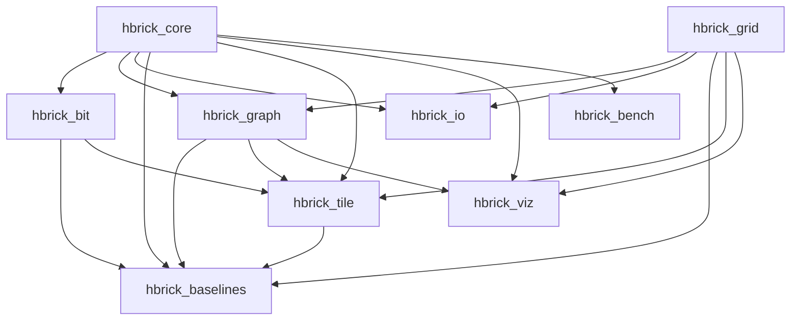
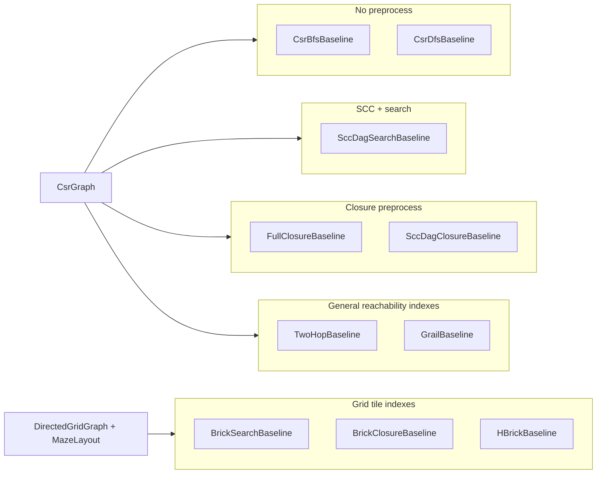

# hbrick Atlas

A quick reference for every major type, data structure, and algorithm in the library.

**See also:** [Representations guide](representations.md) — how mazes, grids, and graphs relate and why conversion happens. Design rationale: [Traversal storage](traversal_storage.md), [Closure storage](closure_storage.md).

---

## Module dependencies

---

## hbrick_core

Shared identifiers, query descriptors, and status types.

| Name | Header | Represents | Purpose | When to use |
|------|--------|------------|---------|-------------|
| [`VertexId`](../include/hbrick/core/vertex_id.hpp) | `core/vertex_id.hpp` | Typed graph vertex index | Wraps a `uint32_t` index with an invalid sentinel | Any API that takes or returns a vertex identifier |
| [`GridCoord`](../include/hbrick/core/grid_coord.hpp) | `core/grid_coord.hpp` | 2D grid cell `(x, y)` | Row-major `linearIndex()` for coord ↔ index mapping | Grid navigation, rendering, grid-to-vertex conversion |
| [`ReachabilityQuery`](../include/hbrick/core/reachability_query.hpp) | `core/reachability_query.hpp` | Source/target vertex pair | Describes a single reachability question with validity check | Baseline and test harness query descriptors |
| [`ReachabilityAnswer`](../include/hbrick/core/types.hpp) | `core/types.hpp` | Query result enum | `Reachable` or `Unreachable` | Return type for all reachability algorithms |
| [`BaselineStatus`](../include/hbrick/core/types.hpp) | `core/types.hpp` | Preprocess lifecycle enum | `NotRun`, `Completed`, `SkippedByPolicy`, `OutOfMemory`, `Failed` | Report outcome of baseline preprocessing |
| [`kInvalidVertexId`](../include/hbrick/core/vertex_id.hpp) | `core/vertex_id.hpp` | Sentinel constant | `uint32_t` max value marking an invalid vertex | Default/uninitialized vertex state |
| [`toString(ReachabilityAnswer)`](../include/hbrick/core/status_reporting.hpp) | `core/status_reporting.hpp` | Diagnostic string | Human-readable reachability label | Logging and test output (not hot paths) |
| [`toString(BaselineStatus)`](../include/hbrick/core/status_reporting.hpp) | `core/status_reporting.hpp` | Diagnostic string | Human-readable baseline status label | Logging and test output (not hot paths) |
| [`libraryVersion()`](../include/hbrick/core/version.hpp) | `core/version.hpp` | Version metadata | Returns compile-time library version string | Version checks in tools and tests |

---

## hbrick_io

MovingAI benchmark map loading and terrain classification.

| Name | Header | Represents | Purpose | When to use |
|------|--------|------------|---------|-------------|
| [`MovingAiTerrain`](../include/hbrick/io/movingai_map.hpp) | `io/movingai_map.hpp` | Terrain class enum | Ground, obstacle, swamp, water, weighted letter, etc. | Classify raw `.map` cell characters |
| [`MovingAiPassabilityPolicy`](../include/hbrick/io/movingai_map.hpp) | `io/movingai_map.hpp` | Passability policy enum | Ground-only, ground+swamp, all traversable, weighted letters | Control which terrain cells become passable in `MazeLayout` |
| [`MovingAiMap`](../include/hbrick/io/movingai_map.hpp) | `io/movingai_map.hpp` | Parsed `.map` grid | Raw cells plus metadata; `toMazeLayout(policy)` conversion | Hold loaded benchmark maps before graph conversion |
| [`MovingAiLoadResult`](../include/hbrick/io/movingai_loader.hpp) | `io/movingai_loader.hpp` | Load outcome | Parsed map or error string on failure | Check I/O success in tools and tests |
| [`loadMovingAiMap`](../include/hbrick/io/movingai_loader.hpp) | `io/movingai_loader.hpp` | File loader | Reads a `.map` from disk into `MovingAiMap` | Dataset browser, MovingAI integration tests |
| [`parseMovingAiMap`](../include/hbrick/io/movingai_loader.hpp) | `io/movingai_loader.hpp` | String parser | Parses in-memory `.map` content | Unit tests and fixtures without disk I/O |

---

## hbrick_grid

Rectangular maze layouts — the primary **input** format for maze-embedded graphs.

| Name | Header | Represents | Purpose | When to use |
|------|--------|------------|---------|-------------|
| [`MazeLayout`](../include/hbrick/grid/maze_layout.hpp) | `grid/maze_layout.hpp` | Dense bitmap of passable/blocked cells | Mutable grid with coord ↔ vertex mapping and east/south adjacency enumeration | Building or loading maze layouts before graph conversion |
| [`GridDimensions`](../include/hbrick/grid/grid_dimensions.hpp) | `grid/grid_dimensions.hpp` | Width/height metadata | Bounds checking and cell count (`width × height`) | Grid sizing without storing cell data |
| [`Direction`](../include/hbrick/grid/direction.hpp) | `grid/direction.hpp` | Cardinal step (E/S/W/N) | Delta offsets for 4-connected neighbor queries | Walking the grid from a cell |

---

## hbrick_bit

Bit-parallel boolean vectors and transitive closure.

| Name | Header | Represents | Purpose | When to use |
|------|--------|------------|---------|-------------|
| [`BitVector`](../include/hbrick/bit/bit_vector.hpp) | `bit/bit_vector.hpp` | Fixed-width bitset (`uint64_t` words) | `test` / `set` / `reset` / `rowOr` without hot-path allocation | Single reachability row or boolean flag set |
| [`BitMatrix`](../include/hbrick/bit/bit_matrix.hpp) | `bit/bit_matrix.hpp` | Dense V×V boolean matrix | One `BitVector` per row; row-wise bit-parallel access | Adjacency or reachability matrix storage — see [Closure storage](closure_storage.md) |
| [`BooleanClosure`](../include/hbrick/bit/boolean_closure.hpp) | `bit/boolean_closure.hpp` | Transitive-closure algorithm | Warshall's algorithm on `BitMatrix` (`transitiveClosureWarshall`) | Precomputing all-pairs reachability into a bit matrix |

---

## hbrick_graph — storage and builders

Graph topology representations and construction utilities.

| Name | Header | Represents | Purpose | When to use |
|------|--------|------------|---------|-------------|
| [`Edge32`](../include/hbrick/graph/edge32.hpp) | `graph/edge32.hpp` | Directed edge `(from, to)` | Lightweight pair of `uint32_t` indices | Ephemeral edge during graph construction |
| [`CsrGraphBuilder`](../include/hbrick/graph/csr_graph_builder.hpp) | `graph/csr_graph_builder.hpp` | Mutable edge collector | Accumulates `Edge32`, sorts, compacts into CSR | Building any directed graph (grid-derived or hand-crafted) |
| [`CsrGraph`](../include/hbrick/graph/csr_graph.hpp) | `graph/csr_graph.hpp` | Immutable directed graph (CSR) | `row_ptrs` + `col_indices`; allocation-free `outNeighbors()` spans | **Canonical** algorithmic graph representation — see [Traversal storage](traversal_storage.md) |
| [`DirectedGridGraph`](../include/hbrick/graph/directed_grid_graph.hpp) | `graph/directed_grid_graph.hpp` | CSR graph + grid metadata | Wraps `CsrGraph` with `width`/`height` and coord helpers | When you need both adjacency lists and grid coordinates |
| [`DirectedGridGraphBuilder`](../include/hbrick/graph/directed_grid_graph_builder.hpp) | `graph/directed_grid_graph_builder.hpp` | Grid-to-graph factory | Converts `MazeLayout` adjacencies into directed edges | Primary entry point for maze/grid → graph conversion |
| [`GridEdgeConversionMode`](../include/hbrick/graph/random_asymmetric_params.hpp) | `graph/random_asymmetric_params.hpp` | Edge-orientation policy enum | `RandomAsymmetric`, `GradientFlow`, `BidirectionalAll`, `AcyclicEastSouth` | Choose how undirected corridors become directed arcs |
| [`RandomAsymmetricParams`](../include/hbrick/graph/random_asymmetric_params.hpp) | `graph/random_asymmetric_params.hpp` | RNG seed and probabilities | Controls seeded random or gradient-flow edge orientation | Parameterize `RandomAsymmetric` and `GradientFlow` conversion modes |

---

## hbrick_graph — algorithms and scratch

Search, decomposition, and reusable traversal workspace.

| Name | Header | Represents | Purpose | When to use |
|------|--------|------------|---------|-------------|
| [`Bfs`](../include/hbrick/graph/bfs.hpp) | `graph/bfs.hpp` | BFS reachability algorithm | Single-pair reachability via breadth-first search on `CsrGraph` | General directed-graph reachability; correctness oracle |
| [`Bfs::reachableCount`](../include/hbrick/graph/bfs.hpp) | `graph/bfs.hpp` | Forward reachable-set size | Counts vertices reachable from a source (including itself) | Reachability density estimation and analysis |
| [`ReachabilityDensityConfig`](../include/hbrick/graph/reachability_density.hpp) | `graph/reachability_density.hpp` | Estimator parameters | `max_samples`, `sample_mode`, `rng_seed`, `num_threads` | Configure sampling, auto-stop, and parallelism — see [Reachability density](reachability_density.md) |
| [`ReachabilityDensityEstimator`](../include/hbrick/graph/reachability_density.hpp) | `graph/reachability_density.hpp` | Sampled density estimator | `begin` / `step` / `stepParallel` / `estimate`; distinct universe sources | Graph connectivity analysis; dataset browser and `test_reachability_density` |
| [`ReachabilityDensitySampleMode`](../include/hbrick/graph/reachability_density.hpp) | `graph/reachability_density.hpp` | Sampling policy enum | `FixedSamples` or `AutoStopWhenStable` | Fixed iteration count vs smart early stopping |
| [`Dfs`](../include/hbrick/graph/dfs.hpp) | `graph/dfs.hpp` | DFS reachability algorithm | Single-pair reachability via depth-first search on `CsrGraph` | Alternative search baseline; SCC building block |
| [`SccDecomposition`](../include/hbrick/graph/scc_decomposition.hpp) | `graph/scc_decomposition.hpp` | SCC labeling | Kosaraju two-pass DFS; maps each vertex → component id | Detect strongly connected components in cyclic graphs |
| [`CondensationGraph`](../include/hbrick/graph/condensation_graph.hpp) | `graph/condensation_graph.hpp` | SCC condensation DAG | Bundles `SccDecomposition` with induced component-level `CsrGraph` | Reduce cyclic graphs to a DAG of super-nodes |
| [`DagReachability`](../include/hbrick/graph/dag_reachability.hpp) | `graph/dag_reachability.hpp` | DAG reachability algorithm | Reachability on acyclic graphs (delegates to BFS) | Query condensation DAGs or acyclic grid conversions |
| [`GraphSearchScratch`](../include/hbrick/graph/graph_search_scratch.hpp) | `graph/graph_search_scratch.hpp` | Traversal workspace | Reusable BFS queue, DFS stack, generation-stamp visited array | Pass to every search/SCC call to avoid hot-path allocation |

**Deep dive:** [`graph_search_scratch.md`](graph_search_scratch.md)

---

## hbrick_baselines

Reference preprocess/query pipelines for correctness validation and benchmarking.

| Name | Header | Represents | Purpose | When to use |
|------|--------|------------|---------|-------------|
| [`CsrBfsBaseline`](../include/hbrick/baselines/csr_bfs_baseline.hpp) | `baselines/csr_bfs_baseline.hpp` | Search baseline (BFS) | Stores CSR copy; runs BFS per query | Minimal-preprocess correctness oracle |
| [`CsrDfsBaseline`](../include/hbrick/baselines/csr_dfs_baseline.hpp) | `baselines/csr_dfs_baseline.hpp` | Search baseline (DFS) | Stores CSR copy; runs DFS per query | Compare search strategies; correctness oracle |
| [`SccDagSearchBaseline`](../include/hbrick/baselines/scc_dag_search_baseline.hpp) | `baselines/scc_dag_search_baseline.hpp` | SCC + DAG search baseline | Preprocess: Kosaraju SCC + condensation; query: map to components + DAG BFS | Validate SCC condensation pipeline on cyclic graphs |
| [`FullClosureBaseline`](../include/hbrick/baselines/full_closure_baseline.hpp) | `baselines/full_closure_baseline.hpp` | Full closure baseline | Preprocess: V×V transitive closure; query: O(1) bit lookup | All-pairs oracle when memory budget allows |
| [`SccDagClosureBaseline`](../include/hbrick/baselines/scc_dag_closure_baseline.hpp) | `baselines/scc_dag_closure_baseline.hpp` | SCC + component closure baseline | Preprocess: SCC + C² component closure; query: O(1) lookup | Closure oracle with lower memory on sparse SCC structure |
| [`TwoHopBaseline`](../include/hbrick/baselines/two_hop_baseline.hpp) | `baselines/two_hop_baseline.hpp` | 2-hop labeling baseline | Preprocess: all-vertex hub cover; query: sorted label intersection | General reachability index baseline; may skip on dense graphs |
| [`GrailBaseline`](../include/hbrick/baselines/grail_baseline.hpp) | `baselines/grail_baseline.hpp` | GRAIL + BFS fallback baseline | Preprocess: random DFS interval labelings; query: tree hit or BFS | Lightweight index baseline for comparison with spatial methods |
| [`BrickSearchBaseline`](../include/hbrick/baselines/brick_search_baseline.hpp) | `baselines/brick_search_baseline.hpp` | Flat BRICK search | Preprocess: `BrickIndex`; query: port-graph BFS with attachments | Grid reachability without global port closure |
| [`BrickClosureBaseline`](../include/hbrick/baselines/brick_closure_baseline.hpp) | `baselines/brick_closure_baseline.hpp` | Flat BRICK closure | Preprocess: `BrickIndex` + port Warshall; query: bit tests on attachments | Fast grid queries when port count fits memory budget |
| [`HBrickBaseline`](../include/hbrick/baselines/hbrick_baseline.hpp) | `baselines/hbrick_baseline.hpp` | H-BRICK hierarchical index | Preprocess: `HBrickIndex`; query: boolean propagation up ancestor chain | Configurable `group_size` and `max_depth` on large grids |
| [`ClosureMatrixBuilder`](../include/hbrick/baselines/closure_matrix_builder.hpp) | `baselines/closure_matrix_builder.hpp` | Closure preprocessing utility | Estimates memory, checks budget, builds reflexive adjacency `BitMatrix` from `CsrGraph` | Shared helper for closure-based baselines |
| [`BaselineGraphUtils`](../include/hbrick/baselines/baseline_graph_utils.hpp) | `baselines/baseline_graph_utils.hpp` | Baseline preprocessing utility | Transpose CSR, forward reachable sets, sorted label intersection | Shared helper for index baselines |

| Baseline | Preprocess cost | Query cost | Memory |
|----------|----------------|------------|--------|
| `CsrBfsBaseline` / `CsrDfsBaseline` | Copy graph | O(V + E) search | O(V + E) |
| `SccDagSearchBaseline` | Kosaraju SCC + condensation | O(C + E_c) DAG search | O(V + E) |
| `FullClosureBaseline` | O(V³) Warshall | O(1) bit test | O(V²) bits |
| `SccDagClosureBaseline` | SCC + component Warshall | O(1) bit test | O(C²) bits |
| `TwoHopBaseline` | O(V · (V + E)) hub BFS scans | O(\|L_out\| + \|L_in\|) intersection | O(label entries), up to O(V²) |
| `GrailBaseline` | O(k · (V + E)) random DFS trees | O(k) tree checks or O(V + E) BFS fallback | O(k · V) interval labels |
| `BrickSearchBaseline` | Per-tile + port-graph build | O(P + E_port) port BFS | Tile closures + port CSR |
| `BrickClosureBaseline` | Per-tile + port Warshall | O(1) bit tests on ports | Tile closures + P² port closure |
| `HBrickBaseline` | Bottom-up super-tile composition | O(levels × gamma) bit propagation | Base tiles + super summaries |

---

## hbrick_tile

Non-overlapping rectangular tile decomposition, flat BRICK port indexing, and H-BRICK hierarchy composition for grid-embedded graphs.

| Name | Header | Represents | Purpose | When to use |
|------|--------|------------|---------|-------------|
| [`TileSize`](../include/hbrick/tile/tile_size.hpp) | `tile/tile_size.hpp` | Nominal cell tile dimensions | Validates `tw, th >= 2` | Configure base decomposition |
| [`GroupSize`](../include/hbrick/tile/group_size.hpp) | `tile/group_size.hpp` | Child-slot grouping factor | `gw × gh` parent formation at level ≥ 1 | H-BRICK hierarchy config |
| [`TileDecomposition`](../include/hbrick/tile/tile_decomposition.hpp) | `tile/tile_decomposition.hpp` | Non-overlapping slot partition | Maps fine cells to tile slots | Preprocess entry for any tile index |
| [`BaseTileSummary`](../include/hbrick/tile/base_tile_summary.hpp) | `tile/base_tile_summary.hpp` | Per-tile closure + boundary projections | `S_T`, `R_VB`, `R_BV` on one slot | Layer A/B flat BRICK data |
| [`BrickIndex`](../include/hbrick/tile/brick_index.hpp) | `tile/brick_index.hpp` | Flat BRICK product | Base tiles + global port graph + seam edges | `BrickSearch` / `BrickClosure` preprocess |
| [`HierarchyTree`](../include/hbrick/tile/hierarchy_tree.hpp) | `tile/hierarchy_tree.hpp` | Multi-level region tree | Groups base slots into super-regions | H-BRICK structure |
| [`SuperTileComposer`](../include/hbrick/tile/super_tile_composer.hpp) | `tile/super_tile_composer.hpp` | Parent composition algebra | `Γ`, embeddings, `S̄`, exterior `S` | Build one super-tile summary |
| [`HBrickIndex`](../include/hbrick/tile/hbrick_index.hpp) | `tile/hbrick_index.hpp` | Full H-BRICK preprocess product | `BrickIndex` + hierarchy + super summaries | `HBrickBaseline` preprocess |
| [`HBrickConfig`](../include/hbrick/tile/hbrick_config.hpp) | `tile/hbrick_config.hpp` | Hierarchy configuration | `base_tile_size`, `group_size`, `max_depth`, memory cap | Tune H-BRICK builds |

**Guide:** [brick_implementation.md](brick_implementation.md) — phases, query pseudocode, verification gates, and test file names.

---

## hbrick_bench

Reachability baseline benchmarking, timing helpers, and report formatting.

| Name | Header | Represents | Purpose | When to use |
|------|--------|------------|---------|-------------|
| [`BenchTimer`](../include/hbrick/bench/bench_timer.hpp) | `bench/bench_timer.hpp` | Stopwatch | Monotonic start/stop with nanosecond elapsed total | Manual timing of hot-path routines |
| [`BenchSample`](../include/hbrick/bench/bench_sample.hpp) | `bench/bench_sample.hpp` | Timing result record | Name, iteration count, total elapsed nanoseconds | Store and report benchmark results |
| [`measureRepeated`](../include/hbrick/bench/bench_measure.hpp) | `bench/bench_measure.hpp` | Benchmark helper template | Runs a callable N times and returns a `BenchSample` | Repeated micro-benchmark measurement |
| [`ReachabilityBenchmarkJob`](../include/hbrick/bench/reachability_benchmark.hpp) | `bench/reachability_benchmark.hpp` | Incremental benchmark runner | Shared query workload, per-method preprocess/warmup/query/correctness; grid overload for BRICK / H-BRICK | Headless or stepped benchmark execution |
| [`ReachabilityBenchmarkRunner`](../include/hbrick/bench/reachability_benchmark_runner.hpp) | `bench/reachability_benchmark_runner.hpp` | Background job wrapper | Worker thread, cancel/skip, elapsed timer | GUI or async benchmark orchestration |
| [`reachability_benchmark_util`](../include/hbrick/bench/reachability_benchmark_util.hpp) | `bench/reachability_benchmark_util.hpp` | Report helpers | Reference BFS stats, live speedup, step sizing | Interpret benchmark reports |
| [`reachability_benchmark_format`](../include/hbrick/bench/reachability_benchmark_format.hpp) | `bench/reachability_benchmark_format.hpp` | Text formatters | Bytes, counts, stage detail, table cell text | Display benchmark results |

Built-in `ReachabilityBaselineId` values: `CsrBfs`, `CsrDfs`, `SccDagSearch`, `SccDagClosure`, `TwoHop`, `Grail`, `BrickSearch`, `BrickClosure`, `HBrick`, `FullClosure` (last by default). Config fields `brick_tile_size`, `hbrick_group_size`, and `hbrick_max_depth` tune tile baselines.

---

## hbrick_viz

SVG rendering for debugging and test artifacts.

| Name | Header | Represents | Purpose | When to use |
|------|--------|------------|---------|-------------|
| [`SvgCanvas`](../include/hbrick/viz/svg_canvas.hpp) | `viz/svg_canvas.hpp` | In-memory SVG document | Lines, rectangles, text with XML escaping | Low-level drawing primitive for tests and viz |
| [`GridGraphRenderer`](../include/hbrick/viz/grid_graph_renderer.hpp) | `viz/grid_graph_renderer.hpp` | Grid + graph renderer | Draws passable cells and directed edge arrows to SVG | Visualize a maze and its directed graph |

---

## hbrick_test_support

**Not part of the shipped library API.** Helpers in `tests/support/` used by integration and regression tests.

| Name | Header | Represents | Purpose | When to use |
|------|--------|------------|---------|-------------|
| [`MazeParams`](../tests/support/maze_generator.hpp) | `tests/support/maze_generator.hpp` | Maze generation config | Logical room count and carving seed | Parameterize deterministic maze fixtures |
| [`generatePerfectMaze`](../tests/support/maze_generator.hpp) | `tests/support/maze_generator.hpp` | Maze generator | Recursive backtracking → tree maze as `MazeLayout` | Integration tests needing acyclic undirected topology |
| [`generateMazeWithExtraPassages`](../tests/support/maze_generator.hpp) | `tests/support/maze_generator.hpp` | Cyclic maze generator | Adds extra wall removals to introduce cycles | Tests requiring cyclic undirected topology |
| [`buildGridGraph`](../tests/support/reachability_oracle.hpp) | `tests/support/reachability_oracle.hpp` | Grid-to-CSR wrapper | `DirectedGridGraphBuilder::build(...).csrGraph()` | Convenience in tests |
| [`bfsReference`](../tests/support/reachability_oracle.hpp) | `tests/support/reachability_oracle.hpp` | BFS oracle | Ground-truth reachability for test comparison | Validate baselines against BFS |
| [`runAllBaselinesAgainstBfs`](../tests/support/reachability_oracle.hpp) | `tests/support/reachability_oracle.hpp` | All-pairs baseline checker | Runs every baseline and counts BFS mismatches | Integration correctness harness |
| [`expectAllBaselinesMatchBfs`](../tests/support/reachability_oracle.hpp) | `tests/support/reachability_oracle.hpp` | Google Test assertion | Fails test when any baseline disagrees with BFS | End-to-end maze reachability tests |
| [`expectSearchBaselinesMatchBfs`](../tests/support/reachability_oracle.hpp) | `tests/support/reachability_oracle.hpp` | Search-only assertion | Validates BFS/DFS baselines against BFS | Large-graph slice tests |
| [`mutuallyReachableViaBidirectionalBfs`](../tests/support/reachability_oracle.hpp) | `tests/support/reachability_oracle.hpp` | SCC membership check | Two forward BFS passes test mutual reachability | SCC partition validation |
| [`expectSccPartitionMatchesBidirectionalBfs`](../tests/support/reachability_oracle.hpp) | `tests/support/reachability_oracle.hpp` | SCC oracle assertion | Every vertex pair agrees with bidirectional BFS | `test_scc_reachability` |
| [`computeReachabilityPairSliceCount`](../tests/support/reachability_oracle.hpp) | `tests/support/reachability_oracle.hpp` | Pair-slice planner | Splits V² ordered pairs into deterministic slices | Keep large all-pairs tests within time limits |
| [`expectReachabilityOracleAllSlices`](../tests/support/reachability_oracle.hpp) | `tests/support/reachability_oracle.hpp` | Full oracle harness | SCC check plus every baseline on all pair slices | MovingAI and recipe integration tests |
| [`expectReachabilityOracleSlice`](../tests/support/reachability_oracle.hpp) | `tests/support/reachability_oracle.hpp` | Single-slice oracle | SCC check plus baselines on one pair slice | Parametrized per-map tests |
| [`kFullAllPairsVertexLimit`](../tests/support/test_limits.hpp) | `tests/support/test_limits.hpp` | Size threshold | All-pairs in one test when V ≤ 600 | Shared test sizing policy |
| [`kMaxPairsPerSlice`](../tests/support/test_limits.hpp) | `tests/support/test_limits.hpp` | Slice volume cap | Max ordered pairs per Google Test case | Prevent runaway all-pairs cost |
| [`discoverMovingAiMaps`](../tests/support/movingai_map_catalog.hpp) | `tests/support/movingai_map_catalog.hpp` | Map catalog scanner | Lists every `.map` under an extracted MovingAI root | Build parametrized test inputs |
| [`movingAiMapCatalog`](../tests/support/movingai_map_catalog.hpp) | `tests/support/movingai_map_catalog.hpp` | Cached catalog | Singleton list from `datasets/movingai/extracted` | `test_movingai_reachability` |
| [`passabilityPolicyForMovingAiSet`](../tests/support/movingai_map_catalog.hpp) | `tests/support/movingai_map_catalog.hpp` | Set-specific policy | Chooses passability rules per benchmark slug | Catalog graph construction |
| [`randomParamsForMovingAiMap`](../tests/support/movingai_map_catalog.hpp) | `tests/support/movingai_map_catalog.hpp` | Deterministic params | Seeded orientation params from set + map name | Reproducible per-map graphs in tests |
| [`buildGraphFromRecipe`](../tests/support/recipe_graph.hpp) | `tests/support/recipe_graph.hpp` | Recipe-to-graph builder | Loads map, applies recipe policy/mode/seed | `test_recipe_reachability` |
| [`paramsFromRecipe`](../tests/support/recipe_graph.hpp) | `tests/support/recipe_graph.hpp` | Recipe param adapter | Maps saved recipe fields to `RandomAsymmetricParams` | Recipe round-trip tests |
| [`expectBrickSearchMatchesBfs`](../tests/support/reachability_oracle.hpp) | `tests/support/reachability_oracle.hpp` | BRICK-Search oracle | All-pairs check vs BFS on a grid graph | Unit tests for flat BRICK search |

---

## Further reading

- [BRICK / H-BRICK implementation guide](brick_implementation.md) — design, phases 0–11, and verification gates
