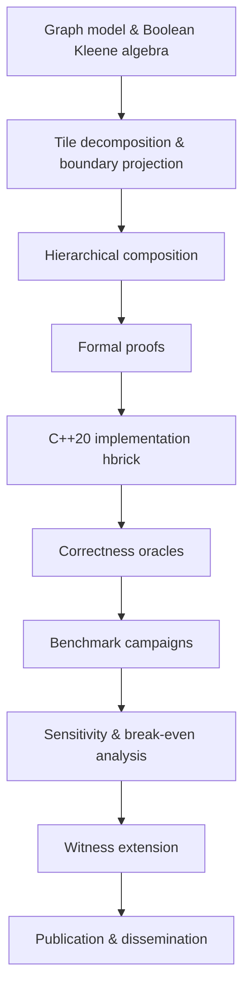

# TÜBİTAK 1001 — Scientific and Technological Research Projects Support Program

## Project Application Form (Draft)

> **Note:** This draft follows the official [1001 application form](file:///home/ozaslan/Downloads/1001_basvuru_formu.doc) structure. Content is written in English as requested; Turkish summaries are included where the template requires bilingual text. Figures, budget spreadsheets, and PBS personnel entries must be finalized before submission.

---

## Cover Information

| Field | Value |
|-------|-------|
| **Project Title (TR)** | Hiyerarşik Sınır-Sıkıştırmalı Kleene Kapanışı ile Yönlendirilmiş Izgara Graflarında Hızlı Erişilebilirlik Sorgulama |
| **Project Title (EN)** | Hierarchical Boundary-Compressed Kleene Closure for Fast Reachability Queries in Directed Grid Graphs |
| **Principal Investigator (PI)** | Assoc. Prof. Dr. Tolga Özaslan |
| **Institution** | Ankara Yıldırım Beyazıt University (AYBU), Department of Computer Engineering, Ankara, Türkiye |
| **Project Duration** | 24 months |
| **Requested Discipline** | Computer Science / Algorithms and Data Structures |
| **Keywords (TR)** | Kleene kapanışı, yönlendirilmiş erişilebilirlik, geçişli kapanış, ızgara grafları, hiyerarşik indeksleme, yol planlama, robotik durum uzayı |
| **Keywords (EN)** | Kleene closure, directed reachability, transitive closure, grid graphs, hierarchical indexing, path planning, robotic state space |

---

## SUMMARY (ÖZET)

### Proje Özeti (Türkçe) — ≤600 words

Yönlendirilmiş ızgara benzeri graflarda tekrarlayan erişilebilirlik sorguları; robotik gezinti, yol planlama, harita analizi ve keşif sistemlerinde temel bir ihtiyaçtır. Ortam sabit kaldığında ve çok sayıda kaynak-hedef çifti sorgulandığında, her sorgu için genişlik-öncelikli arama (BFS) gibi çevrimiçi yöntemler örtüşen bölgeleri tekrar tekrar keşfeder. Tam geçişli kapanış ise doğru ve sabit süreli sorgu sağlar; ancak ön işleme süresi ve bellek maliyeti yoğun erişilebilirlik ilişkilerinde pratik olmayabilir. Güçlü bağlı bileşen (SCC) indirgemesi yönlendirilmiş bağlantıyı özetler; fakat yoğunluk odaklıdır ve alttaki uzamsal düzeni korumaz.

Bu proje, **H-BRICK** (Hierarchical Boundary Reachability Index with Compressed Kleene closure) adlı cebirsel olarak temellendirilmiş bir erişilebilirlik indeksini geliştirmeyi, kanıtlamayı ve kapsamlı biçimde değerlendirmeyi amaçlar. Yöntem, ortamı karolara ayırır; her karoda yerel Boolean Kleene kapanışını hesaplar ve iç durumları gizleyerek yalnızca sınır portları arasındaki yönlendirilmiş erişilebilirliği üst seviyelere aktarır. Alt özetler, arayüz hizalaması ve özyinelemeli kompozisyon ile çok çözünürlüklü bir hiyerarşi oluşturulur; sorgular ise keyfi hücreler arasında tam (exact) yanıt verir.

Proje ekibinin ön çalışması kapsamında C++20 tabanlı **hbrick** kütüphanesi geliştirilmiş; düz BRICK, H-BRICK, SCC-DAG, tam kapanış ve genel erişilebilirlik indeksleri için referans taban çizgileri, 24 birim/entegrasyon testi ve tekrarlanabilir kıyaslama kampanyası altyapısı tamamlanmıştır. Önerilen proje, (i) başlık-yükseltilmiş robotik durum-örgü grafikleri ve potansiyel alan yönlendirmeli örnekler üzerinde ölçeklenebilirlik analizi, (ii) karı boyutu ve hiyerarşi derinliği duyarlılık çalışmaları, (iii) ön işleme–sorgu amortisman eşiklerinin nicel karakterizasyonu, (iv) isteğe bağlı tanık (witness) çıkarımı ve (v) uluslararası hakemli dergi yayını ile açık kaynak yaygınlaştırmasını hedefler.

Beklenen çıktılar: kanıtlanmış hiyerarşik indeksleme çerçevesi, karşılaştırmalı deneysel sonuçlar, üretim kalitesinde yazılım, en az bir Q1/Q2 dergi makalesi, yüksek lisans tez katkısı ve robotik/planlama topluluklarına yönelik bilim iletişimi faaliyetleridir.

### Project Summary (English) — ≤600 words

Repeated reachability queries on directed grid-like graphs are fundamental to robotic navigation, path planning, map analysis, and exploration systems. When the environment is fixed and many source–target pairs must be answered, online methods such as breadth-first search (BFS) repeatedly traverse overlapping regions. Full transitive closure enables constant-time lookup but can be impractical in preprocessing time and memory when the reachability relation becomes dense. Strongly connected component (SCC) condensation is an essential directed reduction, yet it is connectivity-driven and does not preserve the spatial organization of the underlying grid.

This project aims to develop, prove, and comprehensively evaluate **H-BRICK** (Hierarchical Boundary Reachability Index with Compressed Kleene closure), an algebraically grounded reachability index for repeated exact path-existence queries. The method decomposes the environment into tiles, computes local Boolean Kleene closure inside each tile, and compresses interior states by exposing only directed boundary-to-boundary reachability to higher levels. Child summaries are aligned at shared interfaces and composed recursively into a multi-resolution index, while the external query model remains ordinary cell-to-cell (or state-to-state) reachability.

Prior work by the project team has produced the **hbrick** C++20 library: flat BRICK, H-BRICK, SCC-DAG methods, full closure, and general reachability baselines; 24 test executables with BFS oracles; and a reproducible benchmark-campaign toolchain with manifest-driven datasets, correctness checks, and memory caps. The proposed project extends this foundation through (i) scalability studies on heading-lifted robotic state-lattice graphs and potential-field directed instances, (ii) systematic sweeps over base tile size and hierarchy depth, (iii) quantitative characterization of preprocessing–query break-even regimes, (iv) optional hierarchical witness extraction for certifiable positive answers, and (v) international journal publication and open-source dissemination.

Expected outputs include a formally verified hierarchical indexing framework, comparative experimental evidence against BFS, SCC-DAG, flat BRICK, and global closure baselines, production-quality software, at least one international journal article, a master's thesis contribution, and science-communication activities targeting robotics and planning communities.

### Anahtar Kelimeler / Keywords

| Turkish | English |
|---------|---------|
| Kleene kapanışı | Kleene closure |
| yönlendirilmiş erişilebilirlik | directed reachability |
| geçişli kapanış | transitive closure |
| ızgara grafları | grid graphs |
| hiyerarşik indeksleme | hierarchical indexing |
| yol planlama | path planning |
| robotik durum uzayı | robotic state space |

---

## 1. ORIGINAL VALUE (ÖZGÜN DEĞER)

### 1.1. Significance of the Topic and Original Value of the Project

Reachability—deciding whether a directed path exists from a source vertex to a target vertex—is among the most frequently executed graph queries in robotics, games, GIS, and program analysis. In grid-like environments (occupancy maps, mazes, discretized workspaces) and in lifted state spaces (position–heading pairs with motion primitives), directionality breaks the symmetry assumptions of undirected connected-component labeling. Robotics applications increasingly require **repeated exact** reachability answers on a **fixed** graph: frontier accessibility during exploration, semantic region queries, multi-goal mission screening, and batch feasibility checks in state-lattice planners.

The design space spans three extremes:

1. **Per-query search (BFS/DFS):** negligible preprocessing, but cost grows with query volume and graph overlap.
2. **Global materialization (Boolean transitive closure, 2-hop labeling, GRAIL, Path-Tree):** fast queries after preprocessing, but storage and build time can explode on large or dense instances.
3. **Structural reduction (SCC condensation):** powerful for directed connectivity, but discards spatial hierarchy and still requires cross-component resolution on the condensation DAG.

Hierarchical pathfinding methods such as HPA* accelerate **shortest-path** search via abstract graphs; they are not designed as **exact Boolean reachability indexes** for asymmetric directed grids. Sparse Boolean linear algebra (GraphBLAS) supplies computational primitives but does not specify **which** reachability relations to materialize or how to hide interior states behind boundary interfaces.

**Original value of this project**

The project introduces and validates a **compositional Boolean closure framework** in which:

- Local Kleene closure is computed inside spatial tiles;
- Interior vertices participate in closure but are **hidden** via boundary projection \(S_T = P_T A_T^\star P_T^\top\);
- Super-tiles are built by embedding child summaries and closing a reduced interface graph;
- **Exactness** is proved: each composed summary equals the boundary projection of the full reflexive transitive closure of the corresponding region (Theorems 1–3 in the team's draft manuscript).

For square tiles of side \(L\), boundary compression replaces \(O(L^4)\) cell-pair relations with \(O(L^2)\) boundary-pair relations—a perimeter-squared versus area-squared gain that persists under heading-lifted state expansion.

**Distinctiveness from prior art**

| Approach | Objective | Spatial structure | Exact directed reachability index |
|----------|-----------|-------------------|-----------------------------------|
| HPA* / CH / landmarks | Cost-weighted routing | Exploited | No (different problem) |
| 2-hop / GRAIL / O'Reach | General digraph reachability | Not assumed | Yes, but not boundary-compressed |
| SCC condensation | Directed connectivity | Not preserved | Partial (DAG layer only) |
| Full Boolean closure | All-pairs reachability | Not exploited | Yes, but often infeasible |
| **H-BRICK (this project)** | Repeated exact reachability | **Tile hierarchy + boundary ports** | **Yes, with proved compositionality** |

The project team's preliminary implementation (`hbrick`, v0.1.0) already realizes flat BRICK (port-graph search and closure) and H-BRICK (recursive super-tile composition with Boolean vector propagation queries), validated by maze oracles, MovingAI-derived instances, and smoke benchmark campaigns. This BAP proposal funds the **scientific completion** of the research program: large-scale empirical characterization, robotics-relevant state-lifted benchmarks, witness extraction, and international dissemination—not merely incremental coding.

**Quantitative context**

- Grid benchmark families in the experimental plan include side lengths \(\{128, 256, 512, 1024\}\) with controlled directionality (\(p_{\mathrm{bi}} \in \{0, 0.25, 0.5, 0.75, 1.0\}\)) and potential-field correlation (\(\beta \in \{0,1,3,5\}\)).
- Each workload uses 10,000 source–target pairs with BFS reference verification.
- Break-even query count \(Q_{\mathrm{break\text{-}even}} = T_{\mathrm{pre}} / (T_{\mathrm{search}} - T_{\mathrm{query}})\) will be reported per instance class.

References for this section are listed in **EK-1**.

---

### 1.2. Research Question(s) and/or Hypothesis(es)

**Main research question (RQ1):**  
Can exact directed reachability on fixed grid-like and state-lifted graphs be indexed hierarchically by composing boundary-projected Boolean Kleene closures, such that query cost amortizes over repeated workloads while memory scales closer to boundary size than to full cell-pair closure?

**Supporting questions**

| ID | Question |
|----|----------|
| RQ2 | How do base tile size \(b \in \{8,16,32\}\) and hierarchy depth (BRICK-flat, H-BRICK-1/2/3, full) jointly affect preprocessing time, memory, and query latency? |
| RQ3 | Under which directed graph regimes (random asymmetry, potential-field correlation, maze topology, heading-lifted kinematic constraints) does boundary compression remain effective? |
| RQ4 | At what query volume does H-BRICK outperform per-query BFS, SCC-DAG search, and flat BRICK variants on identical workloads? |
| RQ5 | Can optional hierarchical witness matrices provide sound reachability certificates without breaking exactness or hot-path allocation constraints? |

**Hypotheses**

- **H1:** For square spatial tiles, stored summary size scales as \(O(b^2)\) per tile level rather than \(O(b^4)\), and empirical compression ratios versus full transitive closure increase with map size.
- **H2:** Moderate hierarchy depth (2–3 super-tile levels) reduces long-range query latency compared to flat BRICK-Closure, with diminishing returns beyond the depth where interface closures become dense.
- **H3:** Heading-lifted graphs preserve the boundary-compression advantage because boundary spatial cells contribute \(|\mathcal{H}|\) ports per cell, but interior state dimension is still hidden after local closure.
- **H4:** H-BRICK achieves lower break-even query counts on large maps (\(\geq 512 \times 512\)) with mixed local/global workloads than on tiny smoke grids where BFS dominates.

---

### 1.3. Aims and Objectives

**Overall aim**

To establish H-BRICK as a mathematically verified and empirically characterized reachability index for repeated exact queries on directed grid-like and robotic state-lattice graphs, and to disseminate the results as open-source software and international publications.

**Measurable objectives**

| # | Objective | Success criterion | Target time |
|---|-----------|-------------------|-------------|
| O1 | Complete formal correctness proofs and complexity analysis for the implemented composition and query algorithms | Peer-reviewed manuscript section or technical report accepted by project advisory board; all unit tests pass | Month 6 |
| O2 | Implement heading-lifted and potential-field directed graph generators in the benchmark pipeline | ≥3 motion-primitive sets integrated; oracle tests on ≥50 lifted instances | Month 10 |
| O3 | Execute large-scale benchmark campaign on procedural and MovingAI-derived maps | ≥200 completed (map, method, config) rows with zero correctness mismatches; results.csv + analysis notebooks | Month 16 |
| O4 | Characterize tile-size / depth / directionality sensitivity and break-even query regimes | Publishable figures for ≥5 structural dimensions; break-even tables for ≥4 map size classes | Month 18 |
| O5 | Prototype optional hierarchical witness extraction with proved soundness | Witness soundness proposition implemented; demo on ≥10 positive queries | Month 20 |
| O6 | Release hbrick v1.0 with documentation, CI, and campaign reproduction guide | Public repository tag; Doxygen site; README reproduction under 30 minutes | Month 22 |
| O7 | Submit international journal article and present at ≥1 conference/workshop | Manuscript submitted to IEEE Access or equivalent; accepted talk or poster | Month 24 |

---

## 2. METHOD (YÖNTEM)

### 2.1. Research Design

The project follows a **design–prove–implement–measure** methodology aligned with experimental algorithms research:



**Independent variables (experimental factors)**

| Factor | Levels |
|--------|--------|
| Map family | Kruskal/DFS/Prim/recursive-division mazes; random obstacles (10–40%); MovingAI dao/arena/room/game maps |
| Grid side length \(N\) | 128, 256, 512, 1024 |
| Direction model | Random asymmetric (\(p_{\mathrm{bi}}\)); potential field (\(\beta\)); heading-lifted (4 headings, 3 motion primitives) |
| Base tile size \(b\) | 8, 16, 32 (8, 16 for lifted graphs) |
| Hierarchy config | BRICK-Search, BRICK-Closure, H-BRICK-1/2/3, H-BRICK-full |
| Query workload | 10,000 pairs; uniform and distance-stratified (local / medium / global) |

**Dependent variables (outcomes)**

| Outcome | Measurement |
|---------|-------------|
| Preprocessing time | `steady_clock` nanoseconds per phase (base closure, composition) |
| Memory | Peak RSS + estimated index bytes; compression ratio vs full closure |
| Query latency | Mean, median, p95; queries per second (QPS) |
| Correctness | Mismatch count vs directed BFS oracle |
| Structural | Boundary-summary density, SCC statistics, reachability density estimate |
| Amortization | Break-even query count vs BFS |

### 2.2. Theoretical Framework

The algebraic foundation uses the Boolean semiring \((\{0,1\}, \lor, \land)\). For adjacency matrix \(A\), Kleene closure \(A^\star = I \lor A \lor A^2 \lor \cdots\) yields reflexive transitive closure. Boundary projection and composition follow the draft manuscript (Algorithms 1–4). Proofs of permutation invariance, local summary correctness, composition exactness, hierarchical exactness, and query exactness will be finalized with co-investigator support from discrete mathematics / Kleene algebra expertise.

### 2.3. Implementation Method

**Software stack**

- Language: C++20 (GCC ≥11, Clang ≥14)
- Build: CMake 3.20+, presets with LTO and warnings-as-errors
- Tests: Google Test (24 executables), CTest in CI
- Modules: `hbrick_core`, `hbrick_grid`, `hbrick_graph`, `hbrick_bit`, `hbrick_tile`, `hbrick_baselines`, `hbrick_bench`, `hbrick_io`, `hbrick_viz`

**Hot-path engineering constraints** (critical for query performance)

- Zero heap allocations in traversal/query paths
- Contiguous arrays and bit-parallel `BitMatrix` / `BitVector`
- No virtual dispatch or associative containers on hot paths
- Reusable `GraphSearchScratch` with visited-mark stamping

**Algorithms**

| Component | Technique |
|-----------|-----------|
| Local tile closure | Bit-parallel Warshall / Kleene closure on canonical boundary-first ordering |
| Flat BRICK | Global port graph from seam edges; BFS or port-level closure |
| H-BRICK build | Bottom-up `SuperTileComposer`: embed child \(S_{T_i}\), add interface adjacency, close, project to exterior |
| H-BRICK query | Attachment vectors \(x(s), y(t)\); upward propagation; ancestor test \(z_U(s,t)\) |
| Baselines | CSR BFS/DFS, Kosaraju SCC + DAG search/closure, 2-hop, GRAIL, full closure |

### 2.4. Data Collection and Benchmark Protocol

The project uses the **benchmark campaign CLI** (`hbrick_benchmark_campaign`):

1. `init` — create campaign directory and metadata (git commit, compiler, CPU).
2. `generate` / `import-movingai` — build `manifest.csv`, gallery, orientation recipes (JSON).
3. `run --preset all --resume` — execute methods with memory caps (default 512 MB–64 GB policy).
4. Correctness: sample or full-query BFS oracle comparison; mismatches invalidate runs.
5. Warm-up: 1,000 queries excluded from reported timings.
6. Reproducibility: fixed seeds for carving, orientation, and query pairs (`workload.json` hash).

**Infeasibility policy:** Methods exceeding 1 hour preprocess or 64 GB memory are marked `SkippedByPolicy` and reported explicitly (not silently dropped).

### 2.5. Statistical Analysis

- Report mean over ≥5 stochastic seeds for generated maps.
- Stratify query times by reachability status (reachable / unreachable) and Manhattan distance bucket.
- Log-scale plots for preprocessing and memory; QPS leaderboards per `map_class`.
- Break-even curves: cumulative cost \(T_{\mathrm{pre}} + Q \cdot T_{\mathrm{query}}\) vs \(Q \cdot T_{\mathrm{BFS}}\).

### 2.6. Prior Work (Preliminary Results)

The PI's team has completed:

- Full `hbrick` library with flat BRICK and H-BRICK (Phases 0–11 per implementation guide).
- Correctness harness comparing all major baselines against BFS on mazes and MovingAI catalogs.
- Smoke benchmark campaign (`campaigns/smoke`) with zero mismatches on 8×8 random-asymmetric grid.
- Draft journal manuscript: *Hierarchical Boundary-Compressed Kleene Closure for Fast Reachability Queries in Grid Graphs* (IEEE Access format, 19 pages, proofs and experimental sections drafted).

These constitute **TRL 3–4** (experimental proof of concept validated in laboratory environment) and motivate the proposed scale-up.

---

## 3. PROJECT MANAGEMENT (PROJE YÖNETİMİ)

### 3.1.1. Work–Time Schedule (İş–Zaman Çizelgesi)

**Project duration:** 24 months (8 quarters). Effort percentages sum to 100%.

| WP | Work Package | Q1 | Q2 | Q3 | Q4 | Q5 | Q6 | Q7 | Q8 | Effort % | Personnel |
|----|--------------|:--:|:--:|:--:|:--:|:--:|:--:|:--:|:--:|:--------:|-----------|
| WP1 | Formal framework, proofs, and complexity bounds | ● | ● | ○ | | | | | | 15% | PI, Co-I (Mathematics) |
| WP2 | Heading-lifted & potential-field graph pipelines | | ● | ● | ● | | | | | 18% | PI, MSc researcher |
| WP3 | Large-scale benchmark campaigns & dataset curation | | | ● | ● | ● | ● | | | 25% | MSc researcher, PI |
| WP4 | Sensitivity analysis, break-even & visualization | | | | ● | ● | ● | | | 17% | MSc researcher |
| WP5 | Hierarchical witness extraction prototype | | | | | | ● | ● | | 10% | PI, MSc researcher |
| WP6 | Software release, documentation, reproducibility | | ● | | ● | | ● | ● | ● | 10% | MSc researcher |
| WP7 | Dissemination (journal, workshops, open science) | | | | | ● | ● | ● | ● | 5% | PI, all |

● = active quarter, ○ = ramp-up/ramp-down

**Gantt (months 1–24)**

```
Month:  1    3    6    9   12   15   18   21   24
WP1     [========]
WP2          [==============]
WP3               [====================]
WP4                         [==============]
WP5                                   [======]
WP6          [====]     [====]     [========]
WP7                              [============]
```

---

### 3.1.2. Work Package Tables (İş Paketi Tabloları)

#### WP1 — Formal Framework, Proofs, and Complexity Analysis

| Field | Content |
|-------|---------|
| **Goal** | Finalize and internally review all correctness proofs and storage/query complexity bounds for boundary projection and hierarchical composition. |
| **Tasks** | (1) Unify interface-edge and one-cell-overlap formulations; (2) finalize Theorems 1–3 and witness soundness proposition; (3) map proofs to implementation invariants; (4) prepare formal appendix for journal submission. |
| **Personnel & contributions** | **PI (Tolga Özaslan):** algorithm design, proof structure; **Co-I (Elif A. Özaslan, Mathematics):** Kleene-algebraic verification, order-theoretic arguments. |
| **Success criteria** | Proof document ≥30 pages; zero open critical gaps; all `test_super_tile_compose` and oracle gates pass. |
| **Deliverables** | Technical report TR-AYBU-HBRICK-01; journal-ready theory section. |
| **Risks & mitigation** | *Risk:* subtle interface-alignment edge cases in non-rectangular tiles. *Mitigation:* restrict campaign to rectangular tiles; document shape-agnostic extension as future work. |

#### WP2 — Heading-Lifted and Potential-Field Directed Graphs

| Field | Content |
|-------|---------|
| **Goal** | Extend directed graph builders and campaign manifest to robotics-relevant state-lattice and potential-field instances. |
| **Tasks** | (1) Implement 4-heading motion primitives; (2) lift tile boundaries to \(\partial C_T \times \mathcal{H}\); (3) integrate \(\beta\)-swept potential-field orientations; (4) add oracle tests and manifest characterization columns. |
| **Personnel** | **MSc researcher:** implementation and tests; **PI:** primitive semantics and validation design. |
| **Success criteria** | ≥50 lifted instances in manifest; 100% oracle pass; heading port count matches theory \(b_T = \partial c_T |\mathcal{H}|\). |
| **Deliverables** | `heading_lift` recipe mode; updated `docs/representations.md`; campaign subset `campaigns/heading/`. |
| **Risks & mitigation** | *Risk:* state explosion on large maps. *Mitigation:* cap lifted experiments at \(N \leq 512\); use tile sizes 8 and 16 only. |

#### WP3 — Large-Scale Benchmark Campaigns

| Field | Content |
|-------|---------|
| **Goal** | Produce reproducible experimental evidence across map families, methods, and configuration sweeps. |
| **Tasks** | (1) Generate procedural grids \(N \in \{128,256,512,1024\}\); (2) import MovingAI smoke and full catalogs; (3) run presets `csr`, `brick`, `kleene-oracle`, `all`; (4) enforce memory/time policy; (5) archive `results.csv`, `summary.md`, logs. |
| **Personnel** | **MSc researcher:** campaign execution and QC; **PI:** experimental design and baseline selection. |
| **Success criteria** | ≥200 completed benchmark rows; 0 correctness failures; metadata records git hash and hardware. |
| **Deliverables** | `campaigns/run01/` (and successors); analysis scripts; figure set for publication. |
| **Risks & mitigation** | *Risk:* full closure infeasible on large \(N\). *Mitigation:* expected—report as `SkippedByPolicy`; use as upper-bound reference only where feasible. |

#### WP4 — Sensitivity and Break-Even Analysis

| Field | Content |
|-------|---------|
| **Goal** | Quantify how tile size, hierarchy depth, directionality, and query distance distribution affect performance. |
| **Tasks** | (1) Sweeps `--configs brick`, `hbrick`, `all`; (2) compute \(Q_{\mathrm{break-even}}\); (3) plot compression ratio and summary density; (4) compare against SCC-DAG and 2-hop/GRAIL where applicable. |
| **Personnel** | **MSc researcher:** data analysis; **PI:** interpretation and narrative. |
| **Success criteria** | Break-even tables for ≥4 size classes; sensitivity plots for ≥3 structural parameters; internal review complete. |
| **Deliverables** | Analysis notebook; Sections VI–VII of journal manuscript completed. |
| **Risks & mitigation** | *Risk:* inconclusive dominance on small maps. *Mitigation:* frame as regime characterization, not universal speedup claim. |

#### WP5 — Hierarchical Witness Extraction (Optional)

| Field | Content |
|-------|---------|
| **Goal** | Implement and validate optional witness matrices \(W_U\) for certifiable positive queries. |
| **Tasks** | (1) Store midpoint/child-reference witnesses during super-tile closure; (2) recursive unpack on positive \(z_U\); (3) prove soundness (Proposition 1); (4) measure space overhead. |
| **Personnel** | **PI:** witness semantics; **MSc researcher:** implementation. |
| **Success criteria** | 100% witness expansions yield valid directed paths on ≥10 instances; overhead documented. |
| **Deliverables** | `HBrickWitness` API; unit tests; optional benchmark column. |
| **Risks & mitigation** | *Risk:* memory blow-up on dense \(S_U\). *Mitigation:* witness storage off by default; sparse certificate encoding. |

#### WP6 — Software Release and Reproducibility

| Field | Content |
|-------|---------|
| **Goal** | Publish production-quality open-source release with CI, docs, and one-command campaign reproduction. |
| **Tasks** | (1) Tag v1.0; (2) Doxygen + user guides; (3) GitHub Actions matrix; (4) Docker optional image; (5) dataset fetch scripts documented. |
| **Personnel** | **MSc researcher:** packaging; **PI:** API stability review. |
| **Success criteria** | External user reproduces smoke campaign in <30 min following README; CI green on Ubuntu 22.04+. |
| **Deliverables** | GitHub release; Zenodo archive; `docs/benchmark_campaign.md` finalized. |

#### WP7 — Dissemination and Science Communication

| Field | Content |
|-------|---------|
| **Goal** | Share results with academic and robotics communities. |
| **Tasks** | (1) Submit journal article; (2) present at domestic/international CS or robotics venue; (3) tutorial blog post or short video on boundary compression. |
| **Personnel** | **PI:** lead author; **Co-I / MSc:** co-authorship as appropriate. |
| **Success criteria** | Manuscript submitted; ≥1 presentation delivered. |
| **Deliverables** | Journal submission; talk slides; project web page on AYBU server. |

---

### 3.2. Research Facilities (Araştırma Olanakları)

| Infrastructure / Equipment | Location | Use in project |
|----------------------------|----------|----------------|
| PI workstation (Intel Core i7-class, ≥16 GB RAM, SSD) | AYBU Computer Engineering | Development, smoke tests, campaign orchestration |
| University Linux compute server (≥64 GB RAM, multi-core x86_64) | AYBU IT / department lab | Large-map preprocessing, parallel Kleene closure sweeps |
| GitHub + GitHub Actions CI | Cloud | Continuous integration, regression tests |
| MovingAI benchmark archives (`datasets/movingai/`) | Project repository | Public map import for realistic grids |
| CMake / GCC 13 / Clang toolchain | Lab workstations | Reproducible Release builds with LTO |
| Doxygen + Graphviz | Workstations | API documentation generation |
| Optional: department GPU node (if available) | AYBU | Future extension for parallel bit-matrix ops (not critical path) |

No proprietary licenses are required; the entire stack is open-source.

---

## 4. BROADER IMPACT (YAYGIN ETKİ)

### 4.1. Expected Outputs (Öngörülen Çıktılar)

| Output type | Expected output | Timeframe |
|-------------|-----------------|-----------|
| **Scientific / academic** | International journal article (IEEE Access or equivalent Q1/Q2); 1–2 conference presentations (ALGO/ROBOTICS/domestic CS symposium); open technical report on proofs | 12–24 months; post-project citation tracking |
| **Economic / commercial / social** | Open-source `hbrick` library (BSD/MIT license TBD); reproducible benchmark artifacts for industry/academic labs; potential integration into navigation stacks as reachability oracle | 18–24 months; post-project adoption |
| **Researcher training & new projects** | 1 MSc thesis (Computer Engineering, AYBU); groundwork for TÜBİTAK 1003 / EU MSCA follow-on on dynamic or label-constrained reachability | 12–24 months; post-project |

**Potential users:** robotics research groups using occupancy grids or state lattices; game AI studios with fixed nav meshes; GIS and logistics teams with repeated accessibility queries; graph-database researchers studying structured sparse digraphs.

---

### 4.2. Expected Impacts (Öngörülen Etkiler)

**Application domains**

- **Mobile robotics:** fast frontier reachability checks during exploration; feasibility screening in multi-goal missions.
- **Autonomous navigation:** directed flow fields (wind, slopes, traffic rules) on grid abstractions.
- **Non-holonomic planning:** heading-lifted state graphs from motion primitives.
- **Serious games / simulation:** batch connectivity queries on large static maps.

**Socio-economic and policy alignment (12th Development Plan 2024–2028)**

| Policy theme | Project contribution |
|--------------|---------------------|
| **Sustainable and smart transportation** | Faster reachability oracles support traffic and mobility analysis on grid-based road abstractions. |
| **Digital transformation & high technology** | Strengthens domestic algorithmic research infrastructure; reduces reliance on ad-hoc per-query search at scale. |
| **Education quality & lifelong learning** | Open-source library and thesis training; reusable course material for algorithms and robotics. |
| **Civil security / disaster management** | Reachability indexing on evacuation grids and directed contingency routes. |

**Stakeholders:** academic researchers (primary), robotics SMEs integrating planning modules, public-sector R&D centers (TÜBİTAK BİLGEM, ASELSAN academia programs), undergraduate/MSc students.

---

### 4.3. Dissemination and Science Communication Plan

| Element | Plan |
|---------|------|
| **Target audience** | Algorithms & robotics researchers; MSc/PhD students; R&D engineers building navigation systems. |
| **Goals & expected gains** | Increase awareness of boundary-compressed Kleene indexing; provide reproducible benchmarks; attract collaborations on label-constrained and dynamic extensions. |
| **Channels & tools** | GitHub repository and release notes; Zenodo DOI; project page on AYBU web; IEEE Xplore upon acceptance; LinkedIn/ResearchGate summaries; optional 15-min demo video; workshop at AYBU CS seminar series. |
| **Interaction** | Issue tracker for external users; benchmark leaderboard in `summary.md`; respond to replication requests with fixed seeds. |
| **Timeline** | M6: internal seminar; M12: preprint or TechRxiv (if journal policy allows); M18: campaign data public; M22: v1.0 release event; M24: journal submission follow-up and press release via university PR. |

---

## OTHER ITEMS THE APPLICANT WISHES TO STATE (BELİRTMEK İSTEDİĞİNİZ DİĞER KONULAR)

1. **Ethics:** No human subjects, animal experiments, or personal data collection. All benchmarks use synthetic or publicly available maps.

2. **Gender balance:** The project team includes a female co-investigator (Mathematics) and will actively recruit MSc researchers with equal opportunity practices per university policy.

3. **Relation to ongoing publication:** A manuscript draft exists; this project funds the **experimental completion**, software hardening, and witness extension required for publication—not duplicate theoretical work.

4. **Smoke benchmark snapshot (preliminary):**

| Map | Method | QPS | vs BFS | Mismatches |
|-----|--------|-----|--------|------------|
| 8×8 random asymmetric | CsrBfs | 9.77×10⁶ | 1.00× | 0 |
| 8×8 random asymmetric | HBrick | 8.21×10⁵ | 0.03× | 0 |

Small maps favor BFS; the project hypothesis is that H-BRICK advantages emerge at larger \(N\) and higher query volume—exactly what WP3–WP4 will test.

5. **Open science:** All campaign artifacts (manifest, recipes, results, metadata) will be archived with versioned schema (`campaign_schema_version: 2`).

---

## APPENDIX EK-1: REFERENCES (KAYNAKLAR)

1. D. Kozen, "Kleene algebra with tests," *ACM TOPLAS*, vol. 19, no. 3, pp. 427–443, 1997.
2. P. Höfner and B. Möller, "Dijkstra, Floyd and Warshall meet Kleene," *Formal Aspects of Computing*, vol. 24, no. 4, pp. 459–476, 2012.
3. T. Asplund, "Formalizing the Kleene star for square matrices," 2014.
4. A. Armstrong, G. Struth, and T. Weber, "Kleene algebra," *Archive of Formal Proofs*, 2013.
5. S. Warshall, "A theorem on Boolean matrices," *J. ACM*, vol. 9, no. 1, pp. 11–12, 1962.
6. J. Kepner et al., "Mathematical foundations of the GraphBLAS," *IEEE HPEC*, 2016.
7. E. Cohen et al., "Reachability and distance queries via 2-hop labels," *SIAM J. Comput.*, vol. 32, no. 5, pp. 1338–1355, 2003.
8. H. Yildirim, V. Chaoji, and M. J. Zaki, "GRAIL: Scalable reachability index for large graphs," *PVLDB*, vol. 3, no. 1–2, pp. 276–284, 2010.
9. R. Jin et al., "Path-tree: An efficient reachability indexing scheme," *ACM TODS*, vol. 36, no. 1, 2011.
10. K. Hanauer, C. Schulz, and J. Trummer, "O'Reach: Even faster reachability in large graphs," *SEA*, 2021.
11. C. Zhang, A. Bonifati, and M. T. Özsu, "Indexing techniques for graph reachability queries," *ACM Computing Surveys*, vol. 58, no. 6, 2025.
12. A. Botea, M. Müller, and J. Schaeffer, "Near optimal hierarchical path-finding," *J. Game Development*, vol. 1, no. 1, pp. 1–30, 2004.
13. M. R. Jansen and M. Buro, "HPA* enhancements," *AAAI AIIDE*, 2007.
14. R. E. Tarjan, "Depth-first search and linear graph algorithms," *SIAM J. Comput.*, vol. 1, no. 2, pp. 146–160, 1972.
15. M. Pivtoraiko, R. A. Knepper, and A. Kelly, "Differentially constrained mobile robot motion planning in state lattices," *J. Field Robotics*, vol. 26, no. 3, pp. 308–333, 2009.
16. R. Geisberger et al., "Contraction hierarchies," *SEA*, LNCS 5038, 2008.
17. D. Harabor and A. Grastien, "Online graph pruning for pathfinding on grid maps," *AAAI*, 2011.
18. Z. Sun et al., "Frontier detection and reachability analysis for efficient 2D graph-SLAM based active exploration," *IROS*, 2020.
19. Moving AI Lab, "Benchmarks for grid-based pathfinding," https://movingai.com/benchmarks/ (accessed 2026).
20. T. Özaslan and E. A. Özaslan, "Hierarchical boundary-compressed Kleene closure for fast reachability queries in grid graphs," manuscript draft, AYBU / Kastamonu University, 2026.

*Bibliographic formatting will follow TÜBİTAK guidelines before submission.*

---

## APPENDIX EK-2: BUDGET AND JUSTIFICATION (BÜTÇE VE GEREKÇESİ) — OUTLINE

> **Action required:** Enter line items in the official PBS budget module. Amounts below are **placeholders** for planning; adjust to current TÜBİTAK 1001 ceilings and institutional overhead rules.

| Budget item | 24-month estimate (TRY) | Justification |
|-------------|-------------------------|---------------|
| **Personnel — MSc scholarship (bursiyer)** | [TBD] | 24 person-months for WP2–WP6 implementation, campaigns, analysis |
| **Personnel — Project assistant (yardımcı personel)** | [TBD] | 6 person-months for campaign execution, data QC, documentation |
| **Domestic travel** | [TBD] | 2 domestic conference trips (presentation + networking) |
| **International travel** | [TBD] | 1 international conference (EU/US robotics or algorithms) |
| **Consumables** | [TBD] | External SSD storage for campaign archives; cloud backup (if policy allows) |
| **Publication / open access fees** | [TBD] | IEEE Access APC (estimate) |
| **Equipment** | 0 | Existing university workstations sufficient; no major procurement planned |
| **Overhead / institution share** | Per TÜBİTAK rules | AYBU administrative allocation |

**Budget narrative:** The largest cost driver is qualified researcher time for benchmark campaigns (WP3) and analysis (WP4), which are labor-intensive but require minimal wet-lab consumables. Travel supports dissemination (WP7). No expensive equipment is requested because the software is CPU- and memory-bound on existing x86_64 hardware.

---

## PBS CHECKLIST (for online submission)

| Item | Status in this draft |
|------|----------------------|
| Project title (TR/EN) | Filled |
| PI name | Filled — verify title/rank in PBS |
| Institution | Filled — AYBU |
| Project personnel (researchers, advisors) | **Add in PBS:** Co-I Elif A. Özaslan (Advisor/Researcher) |
| Turkish summary ≤600 words | Filled |
| English summary ≤600 words | Filled |
| Section 1.1–1.3 | Filled |
| Section 2 Method | Filled |
| Work–time schedule | Filled |
| Work package tables (≥1 per WP) | Filled (7 WPs) |
| Research facilities table | Filled |
| Section 4.1–4.3 | Filled |
| EK-1 References | Filled (20 entries) |
| EK-2 Budget | Outline — **complete in PBS** |
| Total page limit (≤25 pages excl. appendices policy) | **Trim for final Word/PDF export** — this MD is intentionally comprehensive |

---

*Document generated: 30 June 2026. Source materials: `hbrick` repository, benchmark campaigns, and manuscript draft "Hierarchical Boundary-Compressed Kleene Closure for Fast Reachability Queries in Grid Graphs."*
