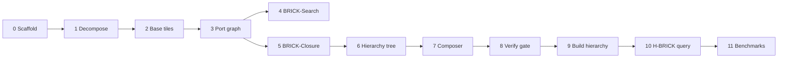

# BRICK / H-BRICK Implementation Plan

Implementation guide for flat BRICK (Phases 0–5) and H-BRICK (Phases 6–11) in `hbrick`.

**Design locked in:**

- Non-overlapping rectangular cell tiles (`tw×th`, both ≥ 2); partial edge tiles OK.
- 1-cell-thick boundary ports; cross-tile glue via **seam edges** from global `CsrGraph` (interface-edge model).
- Port graph nodes = boundary cells (not tile-as-node); tiles are **not** SCCs — queries use attachments `R_VB` / `R_BV`.
- Flat BRICK: global port graph → BRICK-Search (BFS) or BRICK-Closure (Warshall on ports).
- H-BRICK: recursive **tiles-of-tiles** on the slot grid with configurable `group_size (gw×gh)`; query via vector propagation + `z_U` ancestor tests (no global port BFS).

Reuse existing utilities: `CsrGraphBuilder`, `ClosureMatrixBuilder`, `BooleanClosure`, `Bfs`, `GraphSearchScratch`, `BitMatrix`, `BaselineStatus`, `ReachabilityBenchmarkJob`, `reachability_oracle`.

---

## Module layout

| Target | Path | Role |
|--------|------|------|
| `hbrick_tile` | `include/hbrick/tile/`, `src/tile/` | Decomposition, base tiles, port index, hierarchy |
| `hbrick_baselines` | `brick_search_baseline.*`, `brick_closure_baseline.*`, `hbrick_baseline.*` | Query APIs |

```cpp
struct TileSize { uint32_t width; uint32_t height; };       // both >= 2
struct GroupSize { uint32_t group_w; uint32_t group_h; };    // branching at level >= 1

struct HBrickConfig {
    TileSize base_tile_size;
    GroupSize group_size;
    uint32_t max_depth;          // or sentinel for "full" → root
    uint64_t max_memory_bytes;
};
```

---

## Phase roadmap



| Phase | Milestone | Tests |
|-------|-----------|-------|
| **0** | `hbrick_tile` CMake target, `TileSize` validation | `test_tile_size.cpp` |
| **1** | `TileDecomposition`, cell→tile, boundary ports | `test_tile_decomposition.cpp` |
| **2** | `BaseTileSummary`, `S_T`, `R_VB`, `R_BV` | `test_base_tile_summary.cpp` |
| **3** | `PortIndex`, seam edges, `buildPortGraphCsr`, `BrickIndex` | `test_port_graph.cpp` |
| **4** | `BrickSearchBaseline` | `test_brick_search_baseline.cpp` + oracle |
| **5** | `BrickClosureBaseline`, benchmark IDs | oracle + `ReachabilityBenchmarkJob` |
| **6** | `HierarchyTree`, `RegionNode`, `groupTileSlots` | `test_hierarchy_scaffold.cpp` |
| **7** | `SuperTileComposer` | `test_super_tile_compose.cpp` (smoke) |
| **8** | Composition vs oracles | **gate** before Phase 9 |
| **9** | `HierarchyBuilder`, `HBrickIndex` | `test_hierarchy_build.cpp` |
| **10** | `HBrickBaseline` query | `test_hbrick_baseline.cpp` + oracle |
| **11** | Depth/group sweep in benchmarks | integration |

**Flat BRICK complete:** end of Phase 5. **H-BRICK complete:** end of Phase 11.

---

## Phase 0 — Scaffold

- Add `src/tile/CMakeLists.txt`, link `hbrick_tile` from root `CMakeLists.txt`.
- Headers: `tile_size.hpp`, `group_size.hpp`, `tile_slot.hpp`.
- `TileSize::validate()` → false if `width < 2` or `height < 2`.

---

## Phase 1 — Tile decomposition

Partition fine grid: stride `(tw, th)`, origin `(tile_i*tw, tile_j*th)`, clip to map bounds.

**API:**

- `TileDecomposition decompose(uint32_t map_w, map_h, TileSize)`
- `slotAt(GridCoord) → TileSlotId` / `(tile_i, tile_j)`
- `isBoundaryPort(GridCoord, TileSlot) → bool` (passable + on bbox perimeter)
- Port order: N → E → S → W; corners once (N first).

**Tests:** `8×8`, `9×7` maps — full coverage, no overlap, seam touch, partial edge tiles ≥ 2 per axis.

---

## Phase 2 — Base tile summary (Layers A + B)

Per `TileSlot`:

1. Collect passable cells in bbox; build induced `CsrGraph` (intra-tile edges only).
2. `ClosureMatrixBuilder` → `BooleanClosure::transitiveClosureWarshallInPlace` → `local_closure`.
3. Project: `S_T`, `R_VB`, `R_BV`; store `ports[]` with `GridCoord`.
4. `BrickTileIndex` — all base summaries + `vertex → tile` + `vertex → local_index`.

**Tests:** `S_T`, `R_VB`, `R_BV` vs global BFS; memory `SkippedByPolicy`.

**Gate:** must pass before Phase 3.

---

## Phase 3 — Port graph (Layer C)

1. `PortIndex`: `port_id ↔ GridCoord ↔ global vertex`.
2. `collectSeamEdges`: global edge `u→v`, different tiles, both ports.
3. `buildPortGraphCsr`: for each `S_T[p,q]=1` add `p→q`; add seam edges.
4. `BrickIndex` = `BrickTileIndex` + `port_graph` + `PortIndex`.

**Tests:** sampled port-pair reachability vs global BFS.

**Gate:** must pass before Phase 4.

---

## Flat BRICK query algorithms

### Same-tile re-entry

- `local_closure[s,t] == 1` → **Reachable** (shortcut only).
- `local_closure[s,t] == 0` → **not** unreachable; continue.

### BRICK-Search

```
SourcePorts = { p | R_VB(s,p) }
if empty → Unreachable
BFS on port_graph from SourcePorts
for visited q: if R_BV(q,t) → Reachable
```

### BRICK-Closure

Same attachments; `∃ p,q : R_VB(s,p) ∧ port_closure[p,q] ∧ R_BV(q,t)`.

---

## Phase 4 — BrickSearchBaseline

- `preprocess(DirectedGridGraph, TileSize, max_memory_bytes)`
- `query(source, target, GraphSearchScratch)`
- Register in `reachability_oracle.cpp`.
- Re-entry fixture: `local_closure[s,t]=0` but globally reachable.

---

## Phase 5 — BrickClosureBaseline

- Shared `BrickIndex` preprocess + Warshall on port graph.
- `ReachabilityBaselineId::BrickSearch`, `BrickClosure`.
- `SkippedByPolicy` when `P×P` exceeds budget.
- Update `docs/atlas.md`, `README.md`.

---

## H-BRICK preprocess (Phases 6–9)

### Grouping

- Level 0: cell tiles `tw×th`.
- Level ≥ 1: group child **slots** by `gw×gh` (non-overlapping; partial edge groups OK).
- Stop at `max_depth` or single root.

### Per parent region `U` with children `{C_i}`

```
Γ_U  = ordered child ports in U
Â_U  = (⊕_i E_i ⊗ S_{C_i} ⊗ E_i^T) ⊕ A_U^iface
S̄_U  = Â_U*
S_U  = project S̄_U to exterior boundary of U's fine bbox
```

Store per `RegionNode`: `S` (boundary_summary), `S̄` (interface_closure), embeddings metadata for query.

**Do not** re-Warshall fine cells at level ≥ 1 (debug oracle only).

---

## H-BRICK query (Phase 10)

No maze BFS. Boolean vector propagation:

1. `local_closure[s,t]==1` → Reachable.
2. `x[p] = R_VB(s,p)` on ports of `T_s`; if `x` empty → Unreachable.
3. `y[q] = R_BV(q,t)` on ports of `T_t`.
4. Propagate `x` up source ancestor chain: `x_W = x_C · E_C^T · S̄_W · (P_W^ext)^T`.
5. Propagate `y` up target chain: `y_W = P_W^ext · S̄_W · E_C · y_C`.
6. For common ancestors `U` (lowest → root):  
   `z_U = (x_{C_s} · E_{C_s}^T) · S̄_U · (E_{C_t} · y_{C_t})`  
   first `z_U==1` → Reachable; else Unreachable.

---

## Phase 6 — Hierarchy scaffold

- `HierarchyTree`, `RegionNode`, `groupTileSlots(grid, GroupSize)`.
- `externalBoundaryPorts(bbox)`.

---

## Phase 7 — SuperTileComposer

- `buildGammaOrdering`, `buildEmbedding`, `buildIfaceAdjacency`, Warshall, `projectExternalSummary`.

---

## Phase 8 — Verification gate

- `2×2` (or `gw×gh`) base tiles → one parent.
- Compare composed `S_U` vs flat port-graph Warshall on union bbox (Oracle A).
- Tiny maps: cell-region oracle (Oracle B).

**Do not start Phase 9 until this passes.**

---

## Phase 9 — HierarchyBuilder

- Bottom-up to root / `max_depth`; `HBrickIndex` owns base + tree.

---

## Phase 10 — HBrickBaseline

- `preprocess(DirectedGridGraph, HBrickConfig)`.
- `query(source, target)` — steps above; reuse `BitVector` scratch.

---

## Phase 11 — Benchmarks

- `ReachabilityBaselineId::HBrick`.
- Sweep `max_depth` ∈ {1,2,3,full} and `group_size` variants.
- Compare vs BrickSearch, BrickClosure, BFS.

---

## Design rules (code)

1. Seam edges only from global `CsrGraph`; both endpoints passable boundary ports on different tiles.
2. Each fine cell owned by exactly one base tile.
3. Hot `query()` paths: no heap alloc; reuse `GraphSearchScratch` / `BitVector` workspace.
4. Every phase: oracle agreement with `Bfs` on small directed grids before next phase.

---

## Start here

**Phase 0 + 1:** `hbrick_tile` + `TileDecomposition` + `test_tile_decomposition.cpp` on grids from `DirectedGridGraphBuilder`.
