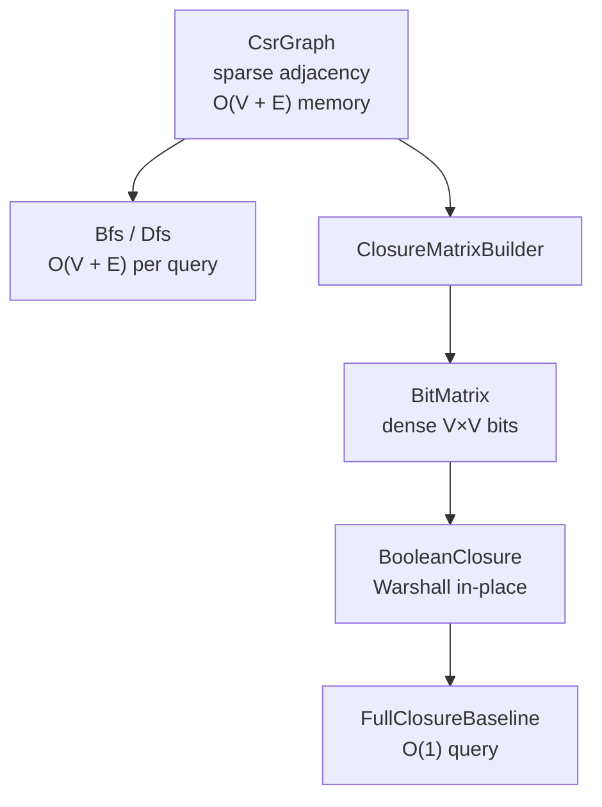

# Closure Storage: BitMatrix and Precomputed Reachability

Why hbrick uses a **dense bit-parallel `BitMatrix`** for transitive-closure baselines instead of a sparse matrix or hash-based reachability index — and how that choice relates to CSR graph storage.

**Primary types:** [`BitMatrix`](../include/hbrick/bit/bit_matrix.hpp), [`BitVector`](../include/hbrick/bit/bit_vector.hpp), [`BooleanClosure`](../include/hbrick/bit/boolean_closure.hpp), [`ClosureMatrixBuilder`](../include/hbrick/baselines/closure_matrix_builder.hpp)

**See also:**
- [Traversal storage](traversal_storage.md) — why the graph itself is stored in sparse CSR form
- [Representations guide](representations.md) — where `BitMatrix` fits in the conversion pipeline
- [Atlas: baselines](atlas.md#hbrick_baselines) — preprocess/query cost comparison

---

## Overview

hbrick uses two different matrix strategies for two different jobs:



| Job | Representation | Why |
|-----|----------------|-----|
| Iterate outgoing edges during search | **Sparse CSR** | O(degree) neighbor access, cache-friendly |
| Answer many reachability queries after preprocess | **Dense BitMatrix** | O(1) bit test after O(V³) Warshall |

The graph stays sparse; the **reachability oracle** is dense. That split is deliberate.

---

## What BitMatrix stores

`BitMatrix` is a row-major boolean matrix: one `BitVector` per row, each row stored as `uint64_t` words. It represents either:

- a **reflexive adjacency relation** (diagonal + direct edges), built from `CsrGraph` by `ClosureMatrixBuilder`, or
- the **transitive closure** of that relation, computed in place by `BooleanClosure::transitiveClosureWarshallInPlace`.

Row access enables bit-parallel operations: Warshall's update `R[i] |= R[k]` becomes a word-wise OR across entire rows (`rowOr`), which is much faster than testing individual bits in a loop.

---

## Why dense, not sparse, for closure

Sparse matrix formats (CSR, CSC, hash-based DOK) excel at **storing** graphs with few edges. They do not automatically excel at **transitive closure**:

| Approach | Storage | Closure compute | Query |
|----------|---------|-----------------|-------|
| **Dense BitMatrix + Warshall** (hbrick) | O(V²) bits | O(V³) word-parallel row ORs | O(1) `test(row, col)` |
| **Sparse adjacency only** | O(E) | Still need closure algorithm | Depends on algorithm |
| **Sparse transitive closure matrix** | O(closure nnz) in theory | Complex; structure changes during closure | Variable |
| **Per-query CSR search** | O(V + E) graph | None | O(V + E) per query |

hbrick chooses dense `BitMatrix` because:

1. **Warshall matches the hardware** — repeated full-row ORs over `uint64_t` words use CPU bit-parallel width efficiently.
2. **O(1) queries after preprocess** — closure baselines exist to validate correctness and benchmark against; a single bit test is the fastest possible query.
3. **Module separation** — `hbrick_bit` is pure boolean algebra with no graph headers. Graph-to-matrix construction lives in `ClosureMatrixBuilder` under `hbrick_baselines`, with explicit memory budgeting.

Sparse closure would require different algorithms (e.g. graph-specific index structures, repeated BFS from every source, or specialized sparse TC methods). Those are out of scope for the current bit-parallel Warshall implementation.

---

## No hash tables here either

Closure storage is dense arrays of bit words — the same "contiguous, cache-conscious, no associative containers" philosophy as traversal, applied to a different problem.

`BitMatrix::test(row, col)` indexes directly into `rows_[row]` at bit position `col`. There is no `(source, target) → bool` hash map.

Hash-based reachability indexes can win when the closed relation remains very sparse after transitive closure. hbrick's closure baselines target the case where paying O(V²) bits is acceptable and query speed matters most.

---

## Memory policy

Full V×V closure does not scale blindly. `ClosureMatrixBuilder` estimates memory **before** allocation:

```cpp
uint64_t estimateReflexiveAdjacencyBytes(uint32_t num_vertices);
bool canAllocateReflexiveAdjacency(uint32_t num_vertices, uint64_t max_memory_bytes);
```

Baselines such as `FullClosureBaseline` and `TwoHopBaseline` check the budget at preprocess time and return `BaselineStatus::SkippedByPolicy` when the configured limit would be exceeded.

For graphs with large V, alternatives in the library include:

| Baseline | Memory | Query |
|----------|--------|-------|
| `CsrBfsBaseline` / `CsrDfsBaseline` | O(V + E) | O(V + E) search |
| `SccDagSearchBaseline` | O(V + E) | O(C + E_c) on condensation DAG |
| `SccDagClosureBaseline` | O(C²) bits | O(1) on component ids |
| `FullClosureBaseline` | O(V²) bits | O(1) |
| `TwoHopBaseline` | O(label entries), up to O(V²) | O(\|L_out\| + \|L_in\|) label intersection |
| `GrailBaseline` | O(k · V) interval labels | O(k) tree checks or O(V + E) BFS fallback |

When the SCC structure is sparse (many small components), `SccDagClosureBaseline` closes over C component nodes instead of V vertices — lower memory than full closure while keeping O(1) queries at the component level.

---

## Building adjacency from CSR

`ClosureMatrixBuilder::buildReflexiveAdjacencyOrThrow` walks the CSR graph once (preprocess, not hot query path):

1. Allocate `BitMatrix(V, V)` after memory check.
2. Set diagonal bits (reflexivity).
3. For each vertex, set bits for all `outNeighbors()`.

That converts sparse edge storage into a dense adjacency bit matrix suitable for Warshall. The sparse-to-dense step is intentional and happens once; queries then hit the dense oracle.

`BooleanClosure` itself never allocates from a graph — it only closes an already-allocated `BitMatrix`. This keeps `hbrick_bit` independent of `hbrick_graph` (see `codex_implementation_spec.md` §3).

---

## When to use closure vs CSR search

| Situation | Prefer |
|-----------|--------|
| One or few reachability queries | CSR + BFS/DFS |
| Many queries, V small enough for O(V²) bits | `FullClosureBaseline` |
| Many queries, graph has sparse SCC structure | `SccDagClosureBaseline` |
| Compare against general sparse reachability indexes | `TwoHopBaseline`, `GrailBaseline` |
| Correctness oracle / benchmark reference | Closure, index, or search baselines as appropriate |
| V large, memory limited | Search baselines; closure and 2-hop skipped by policy |

---

## Related code and tests

| Item | Location |
|------|----------|
| Bit matrix storage | [`src/bit/bit_matrix.cpp`](../src/bit/bit_matrix.cpp) |
| Warshall closure | [`src/bit/boolean_closure.cpp`](../src/bit/boolean_closure.cpp) |
| CSR → BitMatrix adapter | [`src/baselines/closure_matrix_builder.cpp`](../src/baselines/closure_matrix_builder.cpp) |
| Full closure baseline | [`src/baselines/full_closure_baseline.cpp`](../src/baselines/full_closure_baseline.cpp) |
| 2-hop baseline | [`src/baselines/two_hop_baseline.cpp`](../src/baselines/two_hop_baseline.cpp) |
| GRAIL baseline | [`src/baselines/grail_baseline.cpp`](../src/baselines/grail_baseline.cpp) |
| Shared baseline helpers | [`src/baselines/baseline_graph_utils.cpp`](../src/baselines/baseline_graph_utils.cpp) |
| Unit tests | [`tests/unit/test_bit_matrix.cpp`](../tests/unit/test_bit_matrix.cpp), [`tests/unit/test_boolean_closure.cpp`](../tests/unit/test_boolean_closure.cpp), [`tests/unit/test_closure_matrix_builder.cpp`](../tests/unit/test_closure_matrix_builder.cpp), [`tests/unit/test_csr_baselines.cpp`](../tests/unit/test_csr_baselines.cpp) |

---

## Summary

- **Graph storage is sparse (CSR); closure storage is dense (`BitMatrix`)** — different representations for different operations.
- **Sparse closure matrices were not rejected because of hash tables** — they were not chosen because Warshall on dense bit-parallel rows is simpler, faster on current hardware, and matches the baseline oracle use case.
- **Memory guards** prevent silent O(V²) allocation on graphs that exceed configured limits.
- **Hash-based reachability maps** remain unnecessary; direct row/column indexing into bit words suffices when the matrix is dense.
