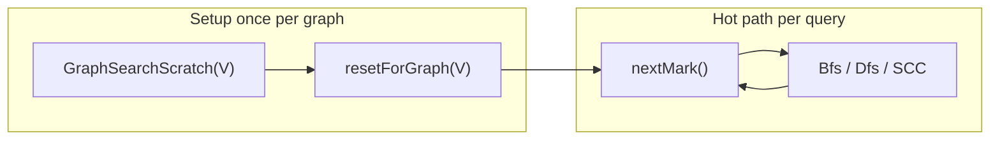

# GraphSearchScratch

`GraphSearchScratch` is the reusable traversal workspace for graph search in hbrick. It holds the temporary state that BFS, DFS, and SCC algorithms need, so hot traversal paths never allocate or resize memory during a query.

**Header:** [`include/hbrick/graph/graph_search_scratch.hpp`](../include/hbrick/graph/graph_search_scratch.hpp)  
**Implementation:** [`src/graph/graph_search_scratch.cpp`](../src/graph/graph_search_scratch.cpp)

---

## Overview

Graph reachability queries need three kinds of temporary storage:

1. A **BFS queue** — frontier of vertices to expand layer by layer
2. A **DFS stack** — frontier of vertices to expand depth-first
3. A **visited set** — avoid revisiting vertices within one traversal

Without scratch, each `reachable()` call would either allocate fresh buffers or pay to clear a full visited array. On a graph with *V* vertices and thousands of queries, that cost becomes expensive and unpredictable.

`GraphSearchScratch` moves all of that work **outside** the hot path:



Callers size scratch once for the graph, then pass the same instance to every subsequent traversal.

---

## The problem

Two naive approaches fail at scale:

| Approach | Cost per query |
|----------|----------------|
| Allocate queue/stack/visited on every call | Heap allocation + deallocation |
| Reuse buffers but `memset` the visited array | O(V) even when the frontier is small |

hbrick runs many reachability queries in benchmarks, baselines, and correctness oracles. Predictable, allocation-free hot paths are a core design requirement (see `.cursorrules` and [`tests/unit/test_hot_path_allocations.cpp`](../tests/unit/test_hot_path_allocations.cpp)).

---

## Buffers

`GraphSearchScratch` owns three `std::vector<uint32_t>` buffers:

| Accessor | Purpose |
|----------|---------|
| `queue()` | BFS frontier |
| `stack()` | DFS frontier (also used in SCC's second pass) |
| `visitedMark()` | Per-vertex visitation stamps |

Sizing happens in `resetForGraph()`:

```cpp
void GraphSearchScratch::resetForGraph(const uint32_t num_vertices) {
    visited_mark_.assign(num_vertices, 0U);
    queue_.clear();
    stack_.clear();
    queue_.reserve(num_vertices);
    stack_.reserve(num_vertices);
    current_mark_ = 1U;
}
```

- `visited_mark_` is sized to exactly `num_vertices`.
- `queue_` and `stack_` are cleared but **reserved** to `num_vertices` (worst-case frontier size for a single-source traversal on a directed graph).

Construct with `GraphSearchScratch(num_vertices)` or default-construct and call `resetForGraph()` when the graph is known.

`memoryBytes()` reports approximate heap usage (sum of vector capacities × `sizeof(uint32_t)`).

---

## Generation-stamp marking

Instead of clearing the whole visited array before each query, scratch uses a **monotonic stamp**:

```cpp
const uint32_t mark = scratch.nextMark();
std::vector<uint32_t>& visited = scratch.visitedMark();

visited[source] = mark;

for (const uint32_t neighbor : graph.outNeighbors(vertex)) {
    if (visited[neighbor] == mark) {
        continue;  // already visited in this query
    }
    visited[neighbor] = mark;
}
```

For each query:

1. `nextMark()` returns a new stamp (1, 2, 3, …).
2. A vertex is "visited in this query" iff `visited[v] == mark`.
3. No O(V) memset — only O(visited vertices) writes.

This is the mechanism behind the README's "visited-mark stamping" design principle.

---

## Overflow handling

After roughly 4 billion queries on the same scratch instance, `current_mark_` would wrap `uint32_t`. `nextMark()` handles that explicitly:

```cpp
uint32_t GraphSearchScratch::nextMark() {
    if (current_mark_ == std::numeric_limits<uint32_t>::max()) {
        std::fill(visited_mark_.begin(), visited_mark_.end(), 0U);
        current_mark_ = 1U;
        return 1U;
    }
    return current_mark_++;
}
```

This prevents silent wraparound bugs where old stamps could be mistaken for the current one. Unit tests cover this path in `tests/unit/test_bfs_dfs.cpp` (`GraphSearchScratch.NextMarkOverflowClearsVisitedMarks`).

---

## Consumers

Every graph search API takes `GraphSearchScratch&` rather than owning buffers internally.

### BFS and DFS

[`Bfs::reachable()`](../include/hbrick/graph/bfs.hpp) and [`Dfs::reachable()`](../include/hbrick/graph/dfs.hpp) follow the same pattern:

1. `nextMark()` for this query
2. `queue().clear()` or `stack().clear()` (logical reset only — capacity unchanged)
3. Stamp-based visited marking
4. Early exit when the target is found

### SCC decomposition

[`SccDecomposition::compute()`](../include/hbrick/graph/scc_decomposition.hpp) implements **Kosaraju's algorithm** and uses scratch across **two DFS passes**:

1. **First pass** (original graph): `visitedMark()` plus a local `DfsFrame` stack for finish-order
2. **Second pass** (transpose graph): `nextMark()` again, reusing `stack()` and `visitedMark()`

Each pass gets a fresh stamp via `nextMark()`, so the second pass does not need to clear visited state from the first. `compute()` calls `resetForGraph()` at the start to ensure buffers match the input graph.

### DAG reachability

[`DagReachability::reachable()`](../include/hbrick/graph/dag_reachability.hpp) delegates to `Bfs::reachable()` on the condensation DAG and inherits the same scratch contract.

### Baselines

Search baselines accept scratch on query (and sometimes preprocess):

| Baseline | Scratch usage |
|----------|---------------|
| `CsrBfsBaseline` | `query(..., scratch)` → BFS |
| `CsrDfsBaseline` | `query(..., scratch)` → DFS |
| `SccDagSearchBaseline` | `preprocess(..., scratch)` for SCC; `query(..., scratch)` for DAG BFS |
| `SccDagClosureBaseline` | `preprocess(..., scratch)` for SCC; queries use precomputed closure (no scratch) |

---

## Usage patterns

### Single scratch, many queries

```cpp
hbrick::GraphSearchScratch scratch(graph.numVertices());

for (uint32_t source = 0; source < graph.numVertices(); ++source) {
    for (uint32_t target = 0; target < graph.numVertices(); ++target) {
        auto answer = hbrick::Bfs::reachable(graph, source, target, scratch);
    }
}
```

### Separate preprocess and query scratch (SCC pipelines)

Preprocessing may call `resetForGraph()` and run multi-pass algorithms. Keep a dedicated query scratch so the query loop never shares mutable state with preprocess:

```cpp
hbrick::GraphSearchScratch preprocess_scratch(graph.numVertices());
hbrick::GraphSearchScratch query_scratch(graph.numVertices());

hbrick::SccDagSearchBaseline baseline;
baseline.preprocess(graph, preprocess_scratch);

for (...) {
    baseline.query(source, target, query_scratch);
}
```

### Resizing for a new graph

```cpp
scratch.resetForGraph(new_graph.numVertices());
```

This resizes `visited_mark_`, re-reserves queue/stack, and resets the stamp counter to 1.

---

## Performance contract

After initial sizing, hot-path algorithms must **not** grow scratch vector capacities:

- `Bfs::reachable()` and `Dfs::reachable()` only call `queue().clear()` / `stack().clear()` and write into pre-sized `visitedMark()`.
- Baseline `query()` methods that take scratch obey the same rule.

[`tests/unit/test_hot_path_allocations.cpp`](../tests/unit/test_hot_path_allocations.cpp) verifies this by capturing vector capacities before and after all-pairs query loops on maze and diamond graphs. Capacities must remain unchanged.

This aligns with project hot-path rules:

- No heap allocations inside traversal, search, or query functions
- No associative containers on hot paths
- Scratch buffers are the **only** place dynamic memory for graph search lives — paid upfront, not per query

---

## Threading

Benchmarking is single-threaded today. If multi-threaded benchmarking is added later, the rule is:

- **One `GraphSearchScratch` per thread**
- No shared mutable scratch buffers

Stamps, queue contents, and stack contents are all mutated during traversal and are not safe to share across threads without synchronization.

---

## Related references

| Resource | Location |
|----------|----------|
| Public API | [`include/hbrick/graph/graph_search_scratch.hpp`](../include/hbrick/graph/graph_search_scratch.hpp) |
| Implementation | [`src/graph/graph_search_scratch.cpp`](../src/graph/graph_search_scratch.cpp) |
| BFS usage | [`src/graph/bfs.cpp`](../src/graph/bfs.cpp) |
| DFS usage | [`src/graph/dfs.cpp`](../src/graph/dfs.cpp) |
| SCC usage | [`src/graph/scc_decomposition.cpp`](../src/graph/scc_decomposition.cpp) |
| Overflow / reset tests | [`tests/unit/test_bfs_dfs.cpp`](../tests/unit/test_bfs_dfs.cpp) |
| Hot-path allocation tests | [`tests/unit/test_hot_path_allocations.cpp`](../tests/unit/test_hot_path_allocations.cpp) |
| Implementation spec (Stage 5) | [`codex_implementation_spec.md`](../codex_implementation_spec.md) § GraphSearchScratch |
| Doxygen API | Build with `-DHBRICK_BUILD_DOCS=ON`, then see `hbrick::GraphSearchScratch` in `docs/html/index.html` |
