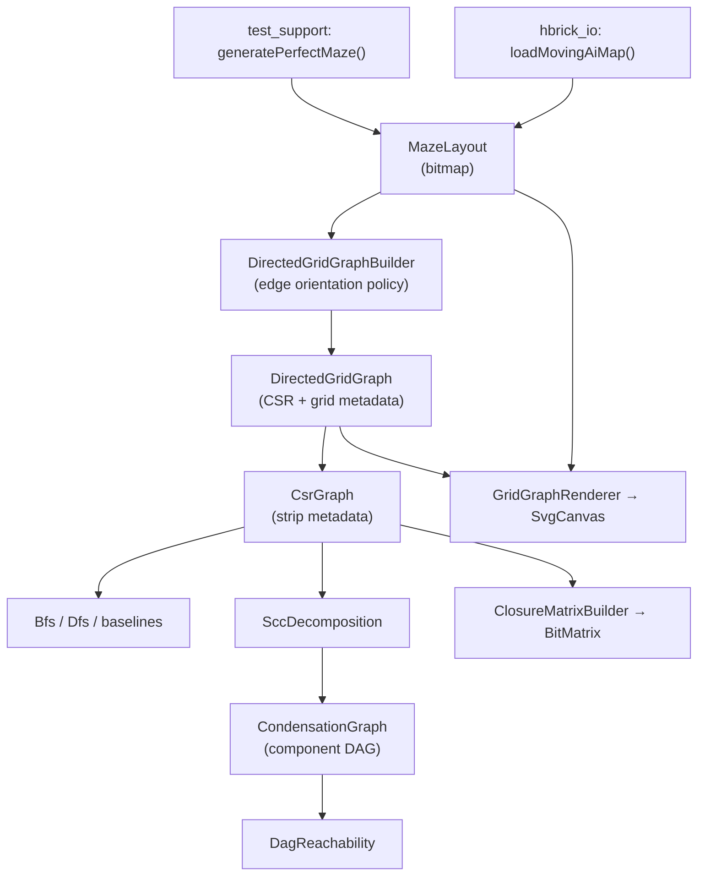

# Representations Guide

How mazes, grids, and graphs relate — and why the library converts between them.

**See also:** [Atlas](atlas.md) — quick reference for every type and algorithm. [Traversal storage](traversal_storage.md) and [Closure storage](closure_storage.md) explain why CSR and BitMatrix are the chosen representations.

---

## Maze layout

A maze layout is a **`MazeLayout`**: a dense bitmap of open/blocked cells. Sources include test-support generators (`generatePerfectMaze`, `generateMazeWithExtraPassages`) and production I/O via [`loadMovingAiMap`](../include/hbrick/io/movingai_loader.hpp) with a [`MovingAiPassabilityPolicy`](../include/hbrick/io/movingai_map.hpp).

The library does **not** run reachability directly on the bitmap. It converts passable adjacencies into a **directed graph** because all search, SCC, and closure algorithms operate on explicit adjacency lists in CSR format.

---

## Terminology

| You might say… | Actual type | Role |
|----------------|-------------|------|
| maze / grid layout | [`MazeLayout`](../include/hbrick/grid/maze_layout.hpp) | Physical topology — which cells connect |
| directed graph | [`CsrGraph`](../include/hbrick/graph/csr_graph.hpp) | Algorithmic adjacency list |
| grid + graph | [`DirectedGridGraph`](../include/hbrick/graph/directed_grid_graph.hpp) | CSR plus width/height for coord mapping and visualization |
| component DAG | [`CondensationGraph`](../include/hbrick/graph/condensation_graph.hpp) | Cycles collapsed into super-nodes |
| reachability matrix | [`BitMatrix`](../include/hbrick/bit/bit_matrix.hpp) | Precomputed all-pairs closure |

---

## Conversion pipeline



### Step-by-step

1. **Maze → `MazeLayout`**  
   Test fixtures use `generatePerfectMaze`, which carves corridors into a physical grid of size `(2×rooms_w+1) × (2×rooms_h+1)`. Odd coordinates are rooms; walls become passable when carved. Production paths load MovingAI `.map` files via `loadMovingAiMap` and convert with `MovingAiMap::toMazeLayout(policy)`.

2. **`MazeLayout` → directed graph**  
   [`DirectedGridGraphBuilder`](../include/hbrick/graph/directed_grid_graph_builder.hpp) scans passable east/south adjacency pairs and applies an edge-orientation policy to produce directed arcs. Output is a [`DirectedGridGraph`](../include/hbrick/graph/directed_grid_graph.hpp) (CSR + grid dimensions).

3. **Strip grid metadata** (optional)  
   Call `.csrGraph()` on `DirectedGridGraph` to get a plain [`CsrGraph`](../include/hbrick/graph/csr_graph.hpp) for algorithms that do not need coordinates.

4. **Further transforms** (optional, same underlying graph)  
   - Cyclic directed graph → [`SccDecomposition`](../include/hbrick/graph/scc_decomposition.hpp) → [`CondensationGraph`](../include/hbrick/graph/condensation_graph.hpp) → [`DagReachability`](../include/hbrick/graph/dag_reachability.hpp)  
   - All-pairs closure → [`ClosureMatrixBuilder`](../include/hbrick/baselines/closure_matrix_builder.hpp) → [`BitMatrix`](../include/hbrick/bit/bit_matrix.hpp) → [`BooleanClosure`](../include/hbrick/bit/boolean_closure.hpp) — see [Closure storage](closure_storage.md) for why closure uses a dense bit matrix rather than a sparse format

---

## Why conversion is necessary

1. **Directed vs undirected.** hbrick targets **directed** reachability. A `MazeLayout` only records that two cells are adjacent (undirected). An explicit orientation policy must choose which direction(s) each corridor becomes an arc.

2. **Algorithmic representation.** CSR adjacency lists give cache-friendly, allocation-free [`outNeighbors()`](../include/hbrick/graph/csr_graph.hpp) spans — required by the hot-path performance rules for BFS, DFS, and SCC. See [Traversal storage](traversal_storage.md) for the full rationale (CSR as sparse matrix, comparison with hash-based adjacency, and hot-path constraints).

3. **Downstream transforms.** SCC condensation and boolean transitive closure need graph topology (edges between vertex indices), not a cell bitmap.

---

## Edge orientation policies

When [`DirectedGridGraphBuilder`](../include/hbrick/graph/directed_grid_graph_builder.hpp) converts a grid, [`GridEdgeConversionMode`](../include/hbrick/graph/random_asymmetric_params.hpp) controls how each passable adjacency becomes directed edges:

| Mode | Effect | Typical use |
|------|--------|-------------|
| `AcyclicEastSouth` | One arc per corridor, aligned with east/south scan order | Deterministic DAG; direct `DagReachability` without SCC |
| `BidirectionalAll` | Two opposing arcs per corridor | Approximates undirected maze walking; one large SCC |
| `RandomAsymmetric` | Seeded mix of bidirectional, one-way, and no edge | Stress tests with varied cycle structure |
| `GradientFlow` | Seeded arcs prefer a global flow angle with backflow noise | Directional bias with controlled cycle injection |

For `RandomAsymmetric` and `GradientFlow`, [`RandomAsymmetricParams`](../include/hbrick/graph/random_asymmetric_params.hpp) supplies the seed and per-adjacency probabilities (`p_bidirectional`, `p_one_way`, `gradient_angle_degrees`, `p_against_gradient`).

---

## Vertex model

Every grid cell is a vertex: `numVertices = width × height`, indexed in **row-major** order.

- Passable cells participate in adjacency edges according to the orientation policy.
- **Impassable cells remain vertices** but receive no incident edges — they are isolated nodes in the graph.

This matters when interpreting reachability results: a query involving an impassable cell's vertex index will not reach any neighbor through graph edges.

Coordinate mapping:

- `MazeLayout::vertexId(coord)` → row-major index wrapped as `VertexId`
- `MazeLayout::coordFromVertex(vertex)` → grid coordinates

---

## Same structure, different views

The same underlying maze geometry can exist in several representations simultaneously. Each is optimized for a different stage:

| Representation | What it stores | Consumed by | Gained | Lost |
|----------------|----------------|-------------|--------|------|
| `MazeLayout` | `width×height` passability bitmap | `DirectedGridGraphBuilder`, `GridGraphRenderer` | Easy editing and carving; implicit 4-connectivity | No directed edges; no fast neighbor iteration for algorithms |
| `DirectedGridGraph` | `CsrGraph` + `width`/`height` | `GridGraphRenderer`, coord-aware tools | Adjacency lists **and** grid coordinates | Slightly larger than bare CSR |
| `CsrGraph` | CSR `row_ptrs` + `col_indices` | `Bfs`, `Dfs`, `SccDecomposition`, all baselines | Canonical hot-path graph; no grid overhead | No coordinate mapping |
| `CondensationGraph` | SCC labels + component-level `CsrGraph` DAG | `DagReachability`, `SccDagSearchBaseline` | Turns cyclic graphs into acyclic super-node graph | Component-level granularity only |
| `BitMatrix` | V×V boolean reachability matrix | `FullClosureBaseline`, `SccDagClosureBaseline` | O(1) query after preprocess | O(V²) memory; no path information |
| Per-vertex label sets | Sorted outgoing/incoming hub labels or DFS intervals | `TwoHopBaseline`, `GrailBaseline` | Sparse-index queries without full closure materialization | Label size varies with reachability density |

---

## When to use which

| Task | Use |
|------|-----|
| Build or edit a maze layout | `MazeLayout` |
| Convert grid to directed graph | `DirectedGridGraphBuilder` |
| Run reachability search | `CsrGraph` + `GraphSearchScratch` + `Bfs` / `Dfs` |
| Estimate average forward reachability fraction | `CsrGraph` + `ReachabilityDensityEstimator` — [guide](reachability_density.md) |
| Keep grid coords alongside graph | `DirectedGridGraph` |
| Render maze and edges | `MazeLayout` + `DirectedGridGraph` + `GridGraphRenderer` |
| Reachability on acyclic directed graph | `DagReachability` (or `AcyclicEastSouth` conversion) |
| Reachability on cyclic directed graph | `SccDecomposition` → `CondensationGraph` → `DagReachability` |
| All-pairs oracle or O(1) lookup baseline | `BitMatrix` via `BooleanClosure` |
| General reachability index baselines | `TwoHopBaseline`, `GrailBaseline` |
| Build a non-grid graph | `CsrGraphBuilder` directly (no grid involved) |

---

## Non-grid graphs

The grid pipeline is one **input path**, not the only one. [`CsrGraphBuilder`](../include/hbrick/graph/csr_graph_builder.hpp) can construct arbitrary directed graphs from hand-specified edges — used in unit tests for diamond, cycle, and other non-grid fixtures.

Typical workflow without a grid:

1. `CsrGraphBuilder builder(num_vertices)`
2. `builder.addEdge(from, to)` for each edge
3. `CsrGraph graph = builder.build()`
4. Run search, SCC, or baselines on `graph`

---

## Mental model

```
Logical maze (rooms)  →  Physical MazeLayout (walls + corridors as bits)
                       →  Directed CsrGraph (orientation policy chooses arcs)
                       →  [optional] Condensation DAG (if cycles in directed view)
                       →  Reachability answer (BFS / DAG search / closure matrix)
```

The word "maze to graph conversion" in tests and docs means: **take a `MazeLayout` topology and materialize explicit directed edges** so graph algorithms can run. You never skip the graph representation — you choose which view of it to hold in memory depending on whether you need coordinates, search, condensation, or precomputed closure.
