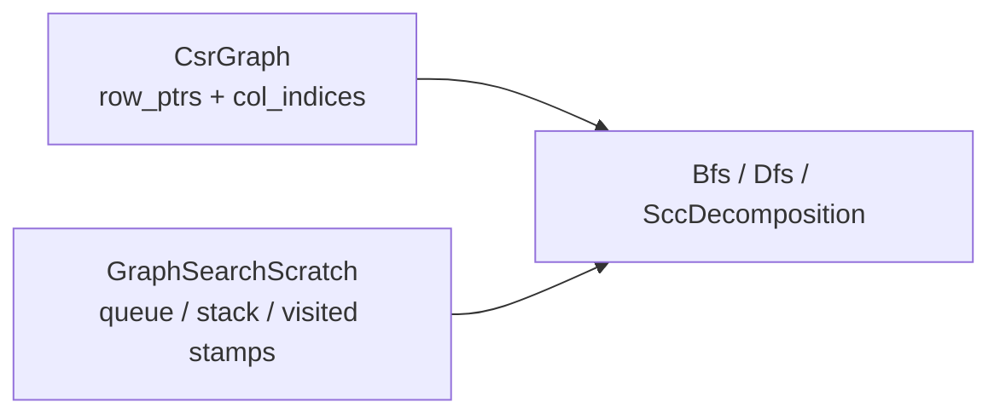

# Traversal Storage: CSR and Search

Why hbrick stores directed graphs in **compressed sparse row (CSR)** format and runs BFS, DFS, and SCC on that representation instead of bitmaps, hash-based adjacency, or dense matrices.

**Primary types:** [`CsrGraph`](../include/hbrick/graph/csr_graph.hpp), [`Bfs`](../include/hbrick/graph/bfs.hpp), [`Dfs`](../include/hbrick/graph/dfs.hpp), [`GraphSearchScratch`](../include/hbrick/graph/graph_search_scratch.hpp)

**See also:**
- [Representations guide](representations.md) — conversion pipeline from maze to graph
- [GraphSearchScratch design notes](graph_search_scratch.md) — reusable traversal workspace
- [Closure storage](closure_storage.md) — why reachability oracles use dense bit matrices instead

---

## Overview

Graph search spends almost all of its time iterating **outgoing neighbors**. The storage format must make that operation fast, predictable, and allocation-free.

hbrick's canonical graph type is `CsrGraph`: two contiguous arrays — `row_ptrs` and `col_indices` — that expose each vertex's adjacency list as a `std::span<const uint32_t>`.



CSR is chosen because it is the standard **array-based sparse matrix** format optimized for row-wise traversal. It is not an alternative to sparsity — it *is* how this library represents a sparse adjacency matrix.

---

## CSR is already a sparse matrix

A directed graph adjacency relation is a sparse boolean matrix: most `(source, target)` pairs are zero, and only `E` entries are one.

CSR stores that matrix as:

| Array | Role |
|-------|------|
| `row_ptrs[v]` | Start index in `col_indices` for row `v` |
| `row_ptrs[v + 1]` | End index (exclusive) for row `v` |
| `col_indices[k]` | Column index of the `k`-th nonzero |

Neighbor lookup is O(1) to obtain the span; iterating neighbors is O(degree):

```cpp
const uint32_t begin = row_ptrs_[vertex];
const uint32_t end = row_ptrs_[vertex + 1U];
return {col_indices_.data() + begin, end - begin};
```

No hash tables, no pointer chasing through many small allocations — just contiguous memory and index arithmetic.

---

## Why CSR for BFS and DFS

Both algorithms have the same asymptotic cost for reachability: **O(V + E)**. The graph-access pattern is identical — walk outgoing edges from each frontier vertex. CSR makes that inner loop cache-friendly:

1. **Contiguous neighbor lists** — good spatial locality when scanning a vertex's out-edges.
2. **Allocation-free `outNeighbors()`** — returns a span view; no heap work on the hot path.
3. **Dense vertex numbering** — vertex ids are `0 .. V-1`, which maps directly to array indices in CSR and in the visited-stamp buffer.

BFS and DFS differ only in frontier order (queue vs stack) and memory shape (frontier width vs path depth). Neither is inherently faster on CSR; both benefit equally from the same neighbor access pattern.

For single-pair reachability, DFS may explore fewer vertices in practice by going deep early, but worst-case behavior is the same. BFS finds shortest paths, which matters only when path length is required — not for yes/no reachability.

---

## Comparison with other representations

| Representation | Neighbor iteration | Hot-path issues | Used in hbrick for search? |
|----------------|-------------------|-----------------|----------------------------|
| **CSR** | O(degree), contiguous | None for outgoing traversal | **Yes** — canonical format |
| **CSC** (compressed sparse column) | O(in-degree) for incoming edges | Same virtues as CSR, but for in-neighbors | No (outgoing search only) |
| **`vector<vector<uint32_t>>`** | O(degree) | Scattered allocations, extra indirection | No |
| **Dense adjacency matrix** | O(V) per row scan | Terrible on sparse graphs | No |
| **COO / edge list** | O(E) to find neighbors | Unusable for traversal | Build input only |
| **Hash map adjacency** | O(degree) average | Poor cache locality; node-based containers banned on hot paths | No |
| **`MazeLayout` bitmap** | Must compute N/E/S/W on the fly | Undirected; no explicit arc orientation; bounds checks every step | Input only, converted to CSR |

### Why not hash-based sparse adjacency?

Hash maps (`unordered_map`, `set`, etc.) are one way to represent sparsity, especially for **dynamic** graphs with irregular ids. hbrick does not use them on traversal paths because:

1. **Vertex ids are dense** — grids and CSR builders produce contiguous `0 .. V-1` indices. Array indexing is simpler and faster than hashing.
2. **Cache unpredictability** — hash buckets scatter memory; CSR keeps edge targets in one array.
3. **Hot-path rules** — `.cursorrules` forbids associative containers inside traversal, search, and query functions. See [Hot-path constraints](#hot-path-constraints).

Hash-based sparsity is a good fit when vertex labels are sparse strings or ids with large gaps. That is not hbrick's model.

### Why not search directly on `MazeLayout`?

A maze bitmap records passable cells and implicit undirected adjacency. Reachability in hbrick is **directed**. Converting to CSR materializes explicit arcs under an orientation policy (`AcyclicEastSouth`, `BidirectionalAll`, `RandomAsymmetric`, `GradientFlow`) and produces a representation that all downstream algorithms share — search, SCC, condensation, and closure building.

The conversion cost is paid once at preprocess time; every query then reuses compact adjacency.

---

## Hot-path constraints

Traversal and query functions (`Bfs::reachable`, `Dfs::reachable`, `CsrGraph::outNeighbors`, SCC passes, bit-parallel `rowOr`, etc.) follow strict performance rules defined in `.cursorrules`:

| Rule | Rationale |
|------|-----------|
| Zero heap allocation in traversal | Predictable latency; no allocator contention |
| No `map` / `unordered_map` / `set` / `unordered_set` | Contiguous arrays and bit words instead of node-based structures |
| No virtual dispatch or RTTI | Static, inlinable control flow |
| Return spans or raw values | Avoid copies and wrapper overhead in inner loops |

These rules explain why CSR plus `GraphSearchScratch` (stamp-array visited set, pre-reserved queue/stack) is the chosen stack — not because sparsity requires hash tables, but because array-based sparsity fits the performance model.

---

## When CSR search is the right tool

| Scenario | CSR + BFS/DFS |
|----------|---------------|
| Few or moderate queries on one graph | Good — minimal preprocess, O(V + E) per query |
| Graph fits in memory, edges are sparse | Good — O(V + E) storage |
| Need directed semantics | Required — bitmap alone is insufficient |
| Many queries, memory budget allows | Consider closure baselines instead — see [Closure storage](closure_storage.md) |
| Need incoming-edge traversal without building reverse CSR | CSR alone is outgoing-only; build CSC or reverse CSR |

---

## Related code and tests

| Item | Location |
|------|----------|
| CSR neighbor access | [`src/graph/csr_graph.cpp`](../src/graph/csr_graph.cpp) |
| BFS reachability | [`src/graph/bfs.cpp`](../src/graph/bfs.cpp) |
| DFS reachability | [`src/graph/dfs.cpp`](../src/graph/dfs.cpp) |
| Hot-path allocation tests | [`tests/unit/test_hot_path_allocations.cpp`](../tests/unit/test_hot_path_allocations.cpp) |
| BFS/DFS correctness | [`tests/unit/test_bfs_dfs.cpp`](../tests/unit/test_bfs_dfs.cpp) |

---

## Summary

- **CSR is a sparse matrix format**, not a dense one — it stores only the `E` nonzero adjacency entries.
- **CSR does not require hash tables** — array-based sparse formats (CSR, CSC, COO) avoid them entirely.
- **BFS and DFS both benefit equally** from CSR's contiguous out-neighbor spans.
- **Hash-based adjacency is avoided** on hot paths for cache, determinism, and alignment with dense vertex numbering — not because sparsity and hashing are inherently linked.
